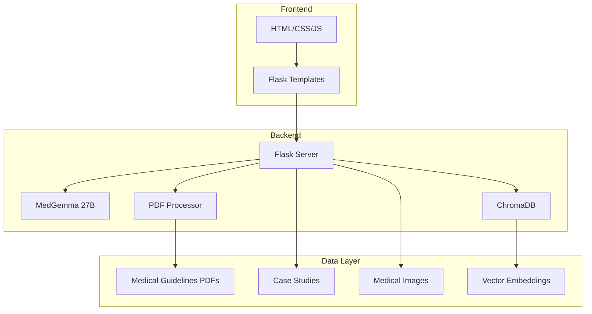

# 📚 Educación Radiológica IMSS

## 📋 Descripción

Sistema de aprendizaje interactivo diseñado para la educación radiológica de estudiantes de medicina y profesionales de la salud. Utiliza casos clínicos reales, análisis de imágenes médicas con IA y un sistema de retroalimentación inteligente para crear una experiencia de aprendizaje inmersiva.

## 🏗️ Arquitectura



## 🚀 Características Principales

### **Casos Clínicos Interactivos**
- Casos reales de radiología
- Progresión de dificultad adaptativa
- Múltiples escenarios clínicos
- Feedback inmediato y detallado

### **Análisis de Imágenes con IA**
- Análisis automático de radiografías
- Identificación de hallazgos patológicos
- Explicaciones detalladas de cada hallazgo
- Comparación con casos normales

### **Sistema de Conocimiento Médico**
- Base de datos de guías médicas
- Búsqueda semántica en documentos
- Referencias bibliográficas actualizadas
- Enlaces a recursos adicionales

### **Interfaz de Aprendizaje**
- Diseño intuitivo y responsivo
- Navegación por casos de estudio
- Sistema de progreso del usuario
- Exportación de resultados

## 🛠️ Tecnologías Utilizadas

- **Backend**: Flask + Python 3.8+
- **IA**: Google MedGemma 27B
- **Base de Datos**: ChromaDB (vector store)
- **Frontend**: HTML5 + CSS3 + JavaScript
- **Procesamiento**: PyPDF2 + LangChain
- **API**: RESTful endpoints

## 📦 Instalación

### **Prerrequisitos:**
```bash
Python 3.8+
pip install -r requirements.txt
ChromaDB
```

### **Instalación:**
```bash
cd Educacion_radiografia
pip install -r requirements.txt
```

### **Configuración de Base de Datos:**
```bash
# Inicializar ChromaDB
python init_database.py

# Cargar guías médicas
python load_guidelines.py
```

## 🚀 Ejecución

### **Desarrollo:**
```bash
python app.py
```

### **Producción:**
```bash
gunicorn -w 4 -b 0.0.0.0:5002 app:app
```

### **Con Docker:**
```bash
docker build -t educacion-radiologia .
docker run -p 5002:5002 educacion-radiologia
```

## 📡 API Endpoints

### **GET /api/health**
Verificar estado del servicio.

**Response:**
```json
{
  "status": "healthy",
  "timestamp": "2024-01-01T00:00:00Z",
  "database": "connected",
  "models": "loaded"
}
```

### **POST /api/analyze_image**
Analizar imagen radiológica.

**Request:**
```json
{
  "image": "base64_encoded_image",
  "case_type": "chest_xray",
  "difficulty": "intermediate"
}
```

**Response:**
```json
{
  "analysis": {
    "findings": ["consolidation", "pleural_effusion"],
    "description": "Se observa consolidación en el lóbulo inferior derecho...",
    "differential_diagnosis": ["neumonía", "atelectasia"],
    "confidence": 0.87
  },
  "educational_content": {
    "explanation": "La consolidación pulmonar es...",
    "references": ["guideline_1", "case_study_2"],
    "next_steps": "Considerar tomografía computarizada..."
  }
}
```

### **GET /api/cases**
Obtener casos de estudio disponibles.

**Response:**
```json
{
  "cases": [
    {
      "id": "case_001",
      "title": "Neumonía Comunitaria",
      "difficulty": "beginner",
      "description": "Caso de neumonía en paciente adulto...",
      "image_count": 3,
      "estimated_time": "15 minutes"
    }
  ]
}
```

### **POST /api/search_guidelines**
Buscar en guías médicas.

**Request:**
```json
{
  "query": "neumonía adquirida en la comunidad",
  "max_results": 5
}
```

**Response:**
```json
{
  "results": [
    {
      "title": "Guía de Neumonía Comunitaria",
      "excerpt": "La neumonía adquirida en la comunidad...",
      "page": 15,
      "relevance_score": 0.92
    }
  ]
}
```

## 🎓 Funcionalidades Educativas

### **Sistema de Progreso**
- Seguimiento de casos completados
- Puntuación por dificultad
- Estadísticas de aprendizaje
- Certificados de progreso

### **Casos de Estudio**
- **Nivel Básico**: Anatomía normal, variantes normales
- **Nivel Intermedio**: Patologías comunes, diagnósticos diferenciales
- **Nivel Avanzado**: Casos complejos, patologías raras

### **Recursos de Aprendizaje**
- Guías clínicas actualizadas
- Atlas de imágenes médicas
- Glosario de términos radiológicos
- Enlaces a literatura médica

## 🔧 Configuración Avanzada

### **Configuración de MedGemma:**
```python
MEDGEMMA_CONFIG = {
    "model_name": "medgemma-27b-it",
    "temperature": 0.3,  # Más conservador para educación
    "max_tokens": 1024,
    "top_p": 0.8
}
```

### **Configuración de ChromaDB:**
```python
CHROMA_CONFIG = {
    "collection_name": "medical_guidelines",
    "embedding_model": "sentence-transformers/all-MiniLM-L6-v2",
    "distance_metric": "cosine"
}
```

### **Configuración de Casos:**
```python
CASE_CONFIG = {
    "max_cases_per_session": 10,
    "difficulty_progression": True,
    "adaptive_learning": True,
    "feedback_delay": 2  # segundos
}
```

## 📊 Monitoreo y Analytics

### **Métricas de Aprendizaje:**
- Tiempo promedio por caso
- Tasa de éxito por dificultad
- Patrones de error comunes
- Progreso individual y grupal

### **Logs del Sistema:**
```bash
# Ver logs en tiempo real
tail -f logs/educacion.log

# Logs de análisis de imágenes
grep "image_analysis" logs/educacion.log

# Logs de búsquedas
grep "search_query" logs/educacion.log
```

## 🧪 Testing

### **Tests Unitarios:**
```bash
pytest tests/unit/
```

### **Tests de Casos Clínicos:**
```bash
pytest tests/cases/
```

### **Tests de Rendimiento:**
```bash
pytest tests/performance/
```

## 🔒 Seguridad y Privacidad

### **Protección de Datos:**
- No almacenamiento de imágenes de pacientes reales
- Anonimización de datos de usuario
- Cumplimiento con LFPDPPP
- Encriptación de datos sensibles

### **Validación de Contenido:**
- Verificación de fuentes médicas
- Validación por expertos clínicos
- Actualización regular de contenido
- Filtrado de información sensible

## 📈 Roadmap

### **Versión 1.1:**
- [ ] Soporte para más modalidades de imagen
- [ ] Integración con LMS (Learning Management System)
- [ ] Sistema de badges y logros
- [ ] Análisis de competencias

### **Versión 1.2:**
- [ ] Realidad virtual para casos 3D
- [ ] Integración con PACS
- [ ] Evaluaciones estandarizadas
- [ ] Certificación profesional

## 🎯 Casos de Uso

### **Para Estudiantes de Medicina:**
- Aprendizaje de anatomía radiológica
- Reconocimiento de patrones patológicos
- Desarrollo de habilidades diagnósticas
- Preparación para exámenes

### **Para Residentes:**
- Casos clínicos complejos
- Actualización de conocimientos
- Preparación para especialización
- Evaluación de competencias

### **Para Profesores:**
- Herramienta de enseñanza
- Generación de casos personalizados
- Seguimiento del progreso estudiantil
- Recursos educativos actualizados

## 🤝 Contribuir

1. Fork del repositorio
2. Crear rama feature (`git checkout -b feature/nueva-funcionalidad`)
3. Commit cambios (`git commit -m 'Agregar nueva funcionalidad'`)
4. Push a la rama (`git push origin feature/nueva-funcionalidad`)
5. Crear Pull Request

## 📄 Licencia

Este proyecto está bajo la licencia MIT. Ver `LICENSE` para más detalles.

## 📞 Soporte

- **Issues**: Reportar problemas en el repositorio
- **Documentación**: Ver documentación completa en `/docs`
- **Email**: [educacion@imss.ai]

---

*Educando el futuro de la radiología con IA*