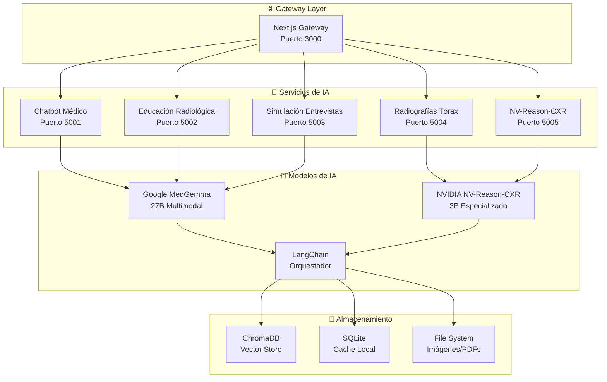

# 🏥 Suite IMSS - Plataforma de Inteligencia Artificial Médica

## 📋 Descripción General

La **Suite IMSS** es una plataforma integral de Inteligencia Artificial médica desarrollada para el Instituto Mexicano del Seguro Social (IMSS). Esta suite demuestra el potencial de la IA especializada en medicina para crear experiencias de aprendizaje interactivas, herramientas de apoyo clínico y simulaciones educativas avanzadas.

### 🎯 **Objetivos Principales:**
- **Educación Médica Avanzada**: Simulaciones interactivas para estudiantes y profesionales
- **Apoyo Clínico**: Herramientas de análisis radiológico con IA especializada
- **Aprendizaje Personalizado**: Entornos adaptativos basados en el progreso del usuario
- **Integración de Modelos**: Orquestación de múltiples modelos de IA médica

---

## 🏗️ Arquitectura de la Plataforma



---

## 🚀 Inicio Rápido

### **Prerrequisitos:**
- Python 3.8+
- Node.js 18+
- Git
- 8GB+ RAM (para modelos de IA)

### **Instalación y Ejecución:**

```bash
# 1. Clonar el repositorio
git clone <repository-url>
cd Pruebas-del-IMSS

# 2. Instalar dependencias
./verify-setup.sh

# 3. Iniciar todos los servicios
./start-all.sh

# 4. Acceder a la plataforma
# Local: http://localhost:3000
# Red: http://[IP_LOCAL]:3000
```

### **Comandos Útiles:**
```bash
# Ver estado de servicios
./show-network-info.sh

# Detener todos los servicios
./stop-all.sh

# Ver logs en tiempo real
tail -f logs/[servicio].log
```

---

## 📚 Proyectos Incluidos

### 1. 🤖 **Chatbot Médico** (`chatbot/`)
**Sistema de consulta médica con IA conversacional**

- **Tecnología**: FastAPI + LangChain + MedGemma
- **Puerto**: 5001
- **Características**:
  - Consultas médicas en lenguaje natural
  - Análisis de imágenes médicas
  - Streaming de respuestas en tiempo real
  - Memoria de conversación contextual

### 2. 📚 **Educación Radiológica** (`Educacion_radiografia/`)
**Sistema de aprendizaje interactivo con casos clínicos**

- **Tecnología**: Flask + MedGemma + ChromaDB
- **Puerto**: 5002
- **Características**:
  - Casos clínicos interactivos
  - Análisis de radiografías con IA
  - Sistema de retroalimentación
  - Base de conocimiento médica

### 3. 🎭 **Simulación de Entrevistas** (`Simulacion/`)
**Simulador de entrevistas pre-visita con pacientes virtuales**

- **Tecnología**: Flask + React + MedGemma + TTS
- **Puerto**: 5003
- **Características**:
  - Pacientes virtuales con condiciones específicas
  - Entrevistas con síntesis de voz
  - Evaluación automática de respuestas
  - Múltiples escenarios clínicos

### 4. 🫁 **Radiografías de Tórax** (`radiografias_torax/`)
**Compañero de aprendizaje radiológico con RAG**

- **Tecnología**: Flask + React + RAG + ChromaDB
- **Puerto**: 5004
- **Características**:
  - Análisis especializado de radiografías de tórax
  - Sistema RAG con guías médicas
  - Interfaz interactiva de aprendizaje
  - Casos de estudio progresivos

### 5. 🔬 **NV-Reason-CXR** (`nv-reason-cxr/`)
**Analizador especializado de radiografías con cadena de razonamiento**

- **Tecnología**: Gradio + NVIDIA NV-Reason-CXR
- **Puerto**: 5005
- **Características**:
  - Análisis paso a paso de radiografías
  - Explicación del razonamiento clínico
  - Modelo especializado en tórax
  - Interfaz web intuitiva

### 6. 🌐 **Gateway Principal** (`UI_IMSS/`)
**Interfaz unificada y punto de entrada principal**

- **Tecnología**: Next.js + TypeScript + Tailwind CSS
- **Puerto**: 3000
- **Características**:
  - Dashboard principal
  - Navegación entre servicios
  - Páginas informativas detalladas
  - Integración con todos los servicios

---

## 🧠 Modelos de IA Utilizados

### **Google MedGemma 27B**
- **Tipo**: Modelo multimodal (texto + imágenes)
- **Especialización**: Medicina general
- **Uso**: Análisis de imágenes, consultas médicas, generación de contenido
- **Licencia**: Health AI Developer Foundations

### **NVIDIA NV-Reason-CXR 3B**
- **Tipo**: Modelo de lenguaje visual (VLM)
- **Especialización**: Radiografías de tórax
- **Uso**: Análisis especializado con cadena de razonamiento
- **Licencia**: NVIDIA OneWay Non-Commercial

### **LangChain**
- **Tipo**: Framework de orquestación
- **Uso**: Conectar y coordinar modelos de IA
- **Licencia**: MIT

---

## 🔧 Configuración Avanzada

### **Variables de Entorno:**
```bash
# URLs de servicios
SERVICIO_CHATBOT_URL=http://localhost:5001
SERVICIO_EDUCACION_URL=http://localhost:5002
SERVICIO_SIMULACION_URL=http://localhost:5003
SERVICIO_RADIOGRAFIAS_URL=http://localhost:5004

# Configuración de IA
MEDGEMMA_ENDPOINT=
LM_STUDIO_URL=http://localhost:1234

# CORS
CORS_ORIGINS=http://localhost:3000,http://localhost:5001,http://localhost:5002,http://localhost:5003,http://localhost:5004
```

### **Docker (Opcional):**
```bash
# Ejecutar con Docker Compose
docker-compose up -d

# Ver logs
docker-compose logs -f

# Detener
docker-compose down
```

---

## 📊 Monitoreo y Logs

### **Logs de Servicios:**
```bash
# Ver logs en tiempo real
tail -f logs/chatbot.log
tail -f logs/educacion.log
tail -f logs/simulacion.log
tail -f logs/radiografias.log
tail -f logs/nv-reason-cxr.log
tail -f logs/gateway.log
```

### **Estado de Servicios:**
```bash
# Verificar estado
./show-network-info.sh

# Verificar puertos
netstat -tulpn | grep -E ':(3000|5001|5002|5003|5004|5005)'
```

---

## 🛠️ Desarrollo

### **Estructura del Proyecto:**
```
Pruebas-del-IMSS/
├── chatbot/                 # Chatbot médico
├── Educacion_radiografia/   # Educación radiológica
├── Simulacion/             # Simulación de entrevistas
├── radiografias_torax/     # Radiografías de tórax
├── nv-reason-cxr/          # NV-Reason-CXR
├── UI_IMSS/                # Gateway principal
├── logs/                   # Logs de servicios
├── k8s/                    # Configuración Kubernetes
└── scripts/                # Scripts de utilidad
```

### **Contribuir:**
1. Fork del repositorio
2. Crear rama feature (`git checkout -b feature/nueva-funcionalidad`)
3. Commit cambios (`git commit -m 'Agregar nueva funcionalidad'`)
4. Push a la rama (`git push origin feature/nueva-funcionalidad`)
5. Crear Pull Request

---

## 📄 Licencias y Atribuciones

### **Modelos de IA:**
- **MedGemma**: Health AI Developer Foundations
- **NV-Reason-CXR**: NVIDIA OneWay Non-Commercial License
- **LangChain**: MIT License

### **Tecnologías:**
- **Next.js**: MIT License
- **React**: MIT License
- **Flask**: BSD License
- **FastAPI**: MIT License
- **Gradio**: Apache 2.0 License

---

## ⚠️ Descargo de Responsabilidad

**IMPORTANTE**: Esta plataforma es únicamente para fines educativos y de investigación. No debe ser utilizada para diagnóstico clínico real sin supervisión médica profesional. Todos los análisis y recomendaciones generados por la IA deben ser verificados por profesionales de la salud calificados.

---

## 📞 Soporte

- **Documentación**: Ver READMEs individuales en cada directorio
- **Issues**: Reportar problemas en el repositorio
- **Contacto**: [Información de contacto del equipo]

---

## 🎉 Agradecimientos

- **Google Health** por MedGemma
- **NVIDIA** por NV-Reason-CXR
- **LangChain** por el framework de orquestación
- **IMSS** por la oportunidad de desarrollo
- **Comunidad Open Source** por las herramientas utilizadas

---

*Desarrollado con ❤️ para la educación médica en México*