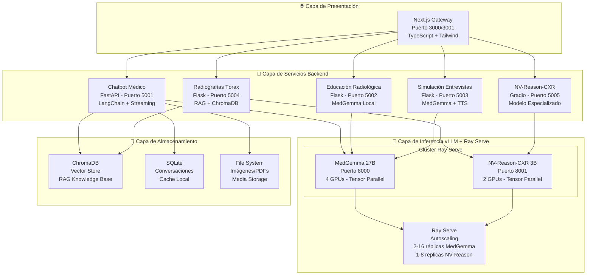

# 🏥 Suite IMSS - Plataforma de Inteligencia Artificial Médica

## 📋 Descripción General

La **Suite IMSS** es una plataforma integral de Inteligencia Artificial médica desarrollada para el Instituto Mexicano del Seguro Social (IMSS). Esta suite demuestra el potencial de la IA especializada en medicina para crear experiencias de aprendizaje interactivas, herramientas de apoyo clínico y simulaciones educativas avanzadas.

### 🎯 **Objetivos Principales:**
- **Educación Médica Avanzada**: Simulaciones interactivas para estudiantes y profesionales
- **Apoyo Clínico**: Herramientas de análisis radiológico con IA especializada
- **Aprendizaje Personalizado**: Entornos adaptativos basados en el progreso del usuario
- **Integración de Modelos**: Orquestación de múltiples modelos de IA médica con vLLM y Ray Serve

---

## 🏗️ Arquitectura Completa del Sistema

### **Arquitectura de Alto Nivel**



### **Flujo de Datos Detallado**

#### **1. Flujo de Consulta en Chatbot Médico**

```
Usuario → Gateway (Next.js) 
    → Chatbot API (FastAPI:5001)
    → LangChain System (langchain_system.py)
    → FallbackLLM (conexión a vLLM)
    → Ray Serve (puerto 8000)
    → MedGemma 27B (4 GPUs)
    → Streaming Response (SSE)
    → Usuario
```

**Componentes Clave:**
- **FastAPI Backend** (`chatbot/main.py`): Maneja peticiones HTTP, streaming, autenticación
- **LangChain System** (`chatbot/langchain_system.py`): Orquesta la cadena de procesamiento
- **FallbackLLM**: Cliente HTTP optimizado con connection pooling, circuit breaker, backoff exponencial
- **vLLM Endpoint**: API compatible con OpenAI en `http://localhost:8000/v1/chat/completions`
- **Memoria Persistente**: SQLite para historial de conversaciones
- **Análisis de Imágenes**: Soporte multimodal con procesamiento de imágenes base64

#### **2. Flujo de Análisis Radiológico**

```
Usuario → Gateway
    → Servicio Radiografías (Flask:5004)
    → RAG System (ChromaDB)
    → NV-Reason-CXR (Gradio:5005)
    → vLLM Ray Serve (puerto 8001)
    → NV-Reason-CXR 3B (2 GPUs)
    → Análisis Especializado
    → Usuario
```

#### **3. Flujo de Educación y Simulación**

```
Usuario → Gateway
    → Educación/Simulación (Flask:5002/5003)
    → MedGemma Local Client
    → vLLM Ray Serve (puerto 8000)
    → MedGemma 27B
    → Respuesta Educativa
    → Usuario
```

---

## 🧠 Sistema de Inferencia vLLM + Ray Serve

### **Arquitectura de Inferencia Distribuida**

El proyecto utiliza **vLLM** con **Ray Serve** para proporcionar inferencia de alto rendimiento y escalable:

#### **Configuración de MedGemma 27B** (`vllm/serve_medgemma.py`)

```python
# Configuración del Motor vLLM
engine_args = AsyncEngineArgs(
    model="google/medgemma-27b-it",
    tensor_parallel_size=4,        # Distribución en 4 GPUs
    dtype="bfloat16",               # Precisión optimizada
    max_model_len=8192,             # Contexto máximo
    gpu_memory_utilization=0.90,   # Uso de VRAM
    enforce_eager=True,             # Modo eager para estabilidad
    trust_remote_code=True,
)

# Autoscaling de Ray Serve
autoscaling_config={
    "min_replicas": 2,              # Mínimo 2 réplicas activas
    "max_replicas": 16,             # Máximo 16 réplicas (64 GPUs)
    "target_ongoing_requests": 5    # Escala con 5+ peticiones en cola
}
```

**Características:**
- **Tensor Parallelism**: Modelo distribuido en 4 GPUs para paralelismo de tensor
- **Autoscaling Inteligente**: Escala automáticamente según la carga
- **API Compatible OpenAI**: Endpoint en `/v1/chat/completions`
- **Streaming Nativo**: Soporte para Server-Sent Events (SSE)
- **Multimodal**: Procesa texto e imágenes en formato base64

#### **Configuración de NV-Reason-CXR 3B** (`vllm/serve_nv_reason.py`)

```python
# Configuración optimizada para modelo 3B
engine_args = AsyncEngineArgs(
    model="nvidia/NV-Reason-CXR-3B",
    tensor_parallel_size=2,          # 2 GPUs suficientes para 3B
    dtype="bfloat16",
    max_model_len=8192,
    gpu_memory_utilization=0.90,
    enforce_eager=True,
    trust_remote_code=True,
)

# Autoscaling más conservador
autoscaling_config={
    "min_replicas": 1,              # 1 réplica mínima
    "max_replicas": 8,              # Máximo 8 réplicas
    "target_ongoing_requests": 3   # Escala con 3+ peticiones
}
```

### **Inicio del Sistema vLLM**

```bash
# Iniciar Ray Serve con MedGemma 27B
cd /home/administrador/vllm
serve run serve_medgemma:medgemma_app \
  --host 0.0.0.0 \
  --port 8000

# Iniciar Ray Serve con NV-Reason-CXR 3B (en otro terminal o nodo)
serve run serve_nv_reason:nv_reason_app \
  --host 0.0.0.0 \
  --port 8001
```

### **Integración con Servicios Backend**

Los servicios backend se conectan a vLLM usando la API compatible con OpenAI:

```python
# Ejemplo de conexión desde LangChain
from langchain_openai import ChatOpenAI

llm = ChatOpenAI(
    model="google/medgemma-27b",
    base_url="http://localhost:8000/v1/",  # Endpoint vLLM
    api_key="not-needed",                   # vLLM no requiere API key
    temperature=0.7,
    streaming=True
)
```

**Optimizaciones Implementadas:**
- **Connection Pooling**: Cliente HTTP singleton para reutilizar conexiones
- **Circuit Breaker**: Protección contra sobrecarga del servidor
- **Backoff Exponencial**: Reintentos inteligentes con jitter
- **Timeout Adaptativo**: Timeouts basados en tamaño del prompt
- **Rate Limiting**: Respeta headers de rate limiting del servidor

---

## 📚 Servicios Detallados

### 1. 🤖 **Chatbot Médico** (`chatbot/`)

**Tecnología**: FastAPI + LangChain + vLLM + Ray Serve

**Puerto**: 5001

**Arquitectura Interna:**

```
chatbot/
├── main.py                    # FastAPI app principal
├── langchain_system.py      # Sistema LangChain con FallbackLLM
├── memory_manager.py          # Gestión de memoria con SQLite
├── medical_analysis.py        # Análisis de imágenes médicas
├── media_storage.py          # Almacenamiento de multimedia
├── transcription_service.py  # Transcripción de audio (Whisper)
├── auth_manager.py           # Autenticación de usuarios
├── security_llm.py           # Validación de seguridad LLM
└── prompts/                  # Prompts médicos especializados
```

**Características Principales:**

1. **Streaming de Respuestas (SSE)**
   - Respuestas en tiempo real usando Server-Sent Events
   - Cancelación de generaciones activas
   - Manejo de errores robusto

2. **Memoria Persistente**
   - SQLite para historial de conversaciones
   - Integración con LangChain ChatMessageHistory
   - Extracción automática de entidades médicas

3. **Análisis Multimodal**
   - Procesamiento de imágenes médicas (base64)
   - Transcripción de audio con Whisper
   - Análisis especializado con MedGemma 27B

4. **Seguridad y Optimización**
   - Rate limiting por usuario
   - Validación de prompts (OWASP LLM Top 10)
   - Circuit breaker para protección del servidor
   - Optimizaciones de VRAM

**Endpoints Principales:**
- `POST /api/chat` - Chat con streaming
- `POST /api/image-analysis` - Análisis de imágenes
- `POST /api/transcribe` - Transcripción de audio
- `GET /api/history` - Historial de conversaciones
- `POST /api/cancel` - Cancelar generación activa
- `GET /health` - Health check

**Variables de Entorno:**
```bash
VLLM_ENDPOINT=http://localhost:8000/v1/  # Endpoint vLLM Ray Serve
CORS_ORIGINS=http://localhost:3000       # Orígenes permitidos
```

### 2. 📚 **Educación Radiológica** (`Educacion_radiografia/`)

**Tecnología**: Flask + MedGemma Local + ChromaDB

**Puerto**: 5002

**Características:**
- Casos clínicos interactivos
- Análisis de radiografías con IA
- Sistema de retroalimentación
- Base de conocimiento médica con RAG

**Integración:**
- Usa cliente local de MedGemma (`local_llm_client.py`)
- Puede conectarse a vLLM endpoint si está disponible
- Cache inteligente para optimizar respuestas

### 3. 🎭 **Simulación de Entrevistas** (`Simulacion/`)

**Tecnología**: Flask + React + MedGemma + TTS (Gemini)

**Puerto**: 5003

**Características:**
- Pacientes virtuales con condiciones específicas
- Entrevistas con síntesis de voz (Gemini TTS)
- Evaluación automática de respuestas
- Múltiples escenarios clínicos

**Flujo:**
1. Usuario selecciona condición médica
2. Sistema genera paciente virtual
3. Entrevista interactiva con streaming
4. Evaluación automática del reporte médico

### 4. 🫁 **Radiografías de Tórax** (`radiografias_torax/`)

**Tecnología**: Flask + React + RAG + ChromaDB

**Puerto**: 5004

**Características:**
- Análisis especializado de radiografías de tórax
- Sistema RAG con guías médicas
- Interfaz interactiva de aprendizaje
- Casos de estudio progresivos

**Arquitectura RAG:**
- ChromaDB como vector store
- Embeddings de documentos médicos
- Búsqueda semántica de información relevante
- Contexto enriquecido para el modelo

### 5. 🔬 **NV-Reason-CXR** (`nv-reason-cxr/`)

**Tecnología**: Gradio + NVIDIA NV-Reason-CXR

**Puerto**: 5005

**Características:**
- Análisis paso a paso de radiografías
- Explicación del razonamiento clínico
- Modelo especializado en tórax (3B parámetros)
- Interfaz web intuitiva con Gradio

**Integración con vLLM:**
- Puede usar modelo local (transformers)
- O conectarse a vLLM Ray Serve en puerto 8001
- Configuración flexible mediante variables de entorno

### 6. 🌐 **Gateway Principal** (`UI_IMSS/`)

**Tecnología**: Next.js 16 + TypeScript + Tailwind CSS

**Puerto**: 3000/3001 (auto-detecta puerto disponible)

**Características:**
- Dashboard principal unificado
- Navegación entre todos los servicios
- Páginas informativas detalladas
- Integración completa con backend

**Estructura:**
```
UI_IMSS/
├── app/                      # App Router de Next.js
│   ├── chat/                # Página de chat
│   ├── home/                # Dashboard principal
│   └── ...
├── components/               # Componentes React
├── hooks/                   # Custom hooks
└── lib/                     # Utilidades
```

**Variables de Entorno:**
```bash
SERVICIO_CHATBOT_URL=http://localhost:5001
SERVICIO_EDUCACION_URL=http://localhost:5002
SERVICIO_SIMULACION_URL=http://localhost:5003
SERVICIO_RADIOGRAFIAS_URL=http://localhost:5004
```

---

## 🚀 Inicio Rápido

### **Prerrequisitos:**
- Python 3.8+
- Node.js 18+
- Git
- CUDA-capable GPU (recomendado: 4+ GPUs para MedGemma 27B)
- Ray Serve instalado y configurado
- vLLM instalado

### **Instalación Paso a Paso:**

#### **1. Clonar y Configurar**

```bash
# Clonar el repositorio
git clone <repository-url>
cd Pruebas-del-IMSS

# Verificar dependencias
./verify-setup.sh
```

#### **2. Configurar vLLM con Ray Serve**

```bash
# Navegar al directorio vllm
cd /home/administrador/vllm

# Iniciar Ray cluster (si no está iniciado)
ray start --head --port=6379

# Iniciar MedGemma 27B en puerto 8000
serve run serve_medgemma:medgemma_app \
  --host 0.0.0.0 \
  --port 8000

# (Opcional) Iniciar NV-Reason-CXR 3B en puerto 8001
serve run serve_nv_reason:nv_reason_app \
  --host 0.0.0.0 \
  --port 8001
```

#### **3. Configurar Variables de Entorno**

Crear archivo `env.local` en la raíz del proyecto:

```bash
# URLs de servicios backend
SERVICIO_CHATBOT_URL=http://localhost:5001
SERVICIO_EDUCACION_URL=http://localhost:5002
SERVICIO_SIMULACION_URL=http://localhost:5003
SERVICIO_RADIOGRAFIAS_URL=http://localhost:5004

# Endpoint vLLM (prioridad)
VLLM_ENDPOINT=http://localhost:8000/v1/

# CORS
CORS_ORIGINS=http://localhost:3000,http://localhost:3001

# Configuración de desarrollo
NODE_ENV=development
FLASK_ENV=development
```

#### **4. Iniciar Todos los Servicios**

```bash
# Desde la raíz del proyecto
./start-all.sh
```

Este script:
- Verifica dependencias
- Limpia procesos anteriores
- Inicia todos los servicios backend
- Inicia el gateway Next.js
- Muestra estado y URLs de acceso

#### **5. Acceder a la Plataforma**

- **Local**: http://localhost:3000 o http://localhost:3001
- **Red Local**: http://[IP_LOCAL]:3000

---

## 🔧 Configuración Avanzada

### **Variables de Entorno Completas**

#### **Backend (Chatbot)**
```bash
# Endpoint vLLM (prioridad)
VLLM_ENDPOINT=http://localhost:8000/v1/

# Fallback endpoints (legacy)
OLLAMA_ENDPOINT=http://localhost:11434/v1/
LM_STUDIO_URL=http://localhost:1234

# CORS
CORS_ORIGINS=http://localhost:3000,http://localhost:3001

# Base de datos
DATABASE_PATH=chatbot.db

# Seguridad
ENABLE_RATE_LIMITING=true
RATE_LIMIT_PER_MINUTE=60
```

#### **vLLM Ray Serve**
```bash
# Configuración de Ray
RAY_ADDRESS=localhost:6379

# Configuración de vLLM
CUDA_VISIBLE_DEVICES=0,1,2,3  # GPUs para MedGemma
PYTORCH_CUDA_ALLOC_CONF=expandable_segments:True
```

### **Optimización de Rendimiento**

#### **vLLM Configuration**
```python
# En serve_medgemma.py
engine_args = AsyncEngineArgs(
    model="google/medgemma-27b-it",
    tensor_parallel_size=4,           # Ajustar según GPUs disponibles
    dtype="bfloat16",                 # Usar float16 si hay problemas de VRAM
    max_model_len=8192,               # Reducir si hay OOM errors
    gpu_memory_utilization=0.90,      # Ajustar según VRAM disponible
    enable_lora=False,
    enforce_eager=True,               # Más estable, menos rápido
    trust_remote_code=True,
)
```

#### **Autoscaling Configuration**
```python
# Ajustar según carga esperada
autoscaling_config={
    "min_replicas": 2,                # Mínimo para respuesta rápida
    "max_replicas": 16,               # Máximo según recursos
    "target_ongoing_requests": 5      # Umbral de escalado
}
```

### **Monitoreo y Logs**

#### **Ver Logs de Servicios**
```bash
# Logs en tiempo real
tail -f logs/chatbot.log
tail -f logs/educacion.log
tail -f logs/simulacion.log
tail -f logs/radiografias.log
tail -f logs/nv-reason-cxr.log
tail -f logs/gateway.log
```

#### **Ver Estado de Ray Serve**
```bash
# Estado del cluster
ray status

# Estado de deployments
serve status

# Logs de Ray Serve
tail -f /tmp/ray/session_latest/logs/serve/MedGemmaDeployment.log
tail -f /tmp/ray/session_latest/logs/serve/NVReasonCXRDeployment.log
```

#### **Monitoreo de GPU**
```bash
# Uso de GPU en tiempo real
watch -n 1 nvidia-smi

# Procesos vLLM
nvidia-smi | grep vLLM
```

### **Comandos Útiles**

```bash
# Ver estado de servicios
./show-network-info.sh

# Detener todos los servicios
./stop-all.sh

# Reiniciar servicios
./start-all.sh restart

# Verificar configuración
./verify-setup.sh
```

---

## 📊 Arquitectura de Datos

### **Flujo de Datos Completo**

#### **1. Consulta de Chat Médico**

```
┌─────────┐
│ Usuario │
└────┬────┘
     │ HTTP POST /api/chat
     ▼
┌─────────────────┐
│ Gateway Next.js │ (Puerto 3000)
└────┬────────────┘
     │ Proxy Request
     ▼
┌──────────────────┐
│ Chatbot FastAPI  │ (Puerto 5001)
│ - main.py        │
└────┬─────────────┘
     │
     ├─► LangChain System
     │   └─► FallbackLLM
     │       └─► HTTP Request
     │
     ▼
┌──────────────────┐
│ Ray Serve        │ (Puerto 8000)
│ - MedGemma 27B   │
│ - 4 GPUs         │
└────┬─────────────┘
     │
     ├─► Streaming Response (SSE)
     │
     ▼
┌──────────────────┐
│ SQLite DB        │
│ - Historial      │
│ - Mensajes       │
└──────────────────┘
```

#### **2. Análisis de Imagen Médica**

```
┌─────────┐
│ Usuario │ (Sube imagen)
└────┬────┘
     │
     ▼
┌──────────────────┐
│ Chatbot API      │
│ - medical_analysis.py
└────┬─────────────┘
     │
     ├─► Procesar imagen (base64)
     │
     ▼
┌──────────────────┐
│ vLLM MedGemma    │
│ - Multimodal     │
│ - Procesa imagen │
└────┬─────────────┘
     │
     ▼
┌──────────────────┐
│ Análisis Médico  │
│ - Respuesta      │
└──────────────────┘
```

### **Almacenamiento de Datos**

#### **SQLite (Chatbot)**
- **Ubicación**: `chatbot/chatbot.db`
- **Tablas**:
  - `messages`: Historial de mensajes
  - `sessions`: Sesiones de conversación
  - `users`: Usuarios (si hay autenticación)

#### **ChromaDB (RAG)**
- **Ubicación**: `data/` (en servicios que usan RAG)
- **Uso**: Vector store para búsqueda semántica
- **Embeddings**: Documentos médicos, guías clínicas

#### **File System**
- **Ubicación**: `chatbot/media/`
- **Estructura**:
  - `image/`: Imágenes médicas
  - `audio/`: Archivos de audio
  - `document/`: PDFs y documentos
  - `compressed/`: Archivos comprimidos

---

## 🧠 Modelos de IA Utilizados

### **Google MedGemma 27B**

**Especificaciones:**
- **Tipo**: Modelo multimodal (texto + imágenes)
- **Parámetros**: 27 mil millones
- **Especialización**: Medicina general
- **Formato**: Instruct (IT) - optimizado para instrucciones
- **Licencia**: Health AI Developer Foundations

**Configuración vLLM:**
- **Tensor Parallelism**: 4 GPUs
- **Precisión**: bfloat16
- **Contexto Máximo**: 8192 tokens
- **VRAM Requerida**: ~20.7GB por GPU × 4 = ~83GB total

**Uso en el Proyecto:**
- Chatbot médico (puerto 5001)
- Educación radiológica (puerto 5002)
- Simulación de entrevistas (puerto 5003)
- Análisis de imágenes médicas

**Endpoint**: `http://localhost:8000/v1/chat/completions`

### **NVIDIA NV-Reason-CXR 3B**

**Especificaciones:**
- **Tipo**: Modelo de lenguaje visual (VLM)
- **Parámetros**: 3 mil millones
- **Especialización**: Radiografías de tórax
- **Característica**: Cadena de razonamiento paso a paso
- **Licencia**: NVIDIA OneWay Non-Commercial

**Configuración vLLM:**
- **Tensor Parallelism**: 2 GPUs
- **Precisión**: bfloat16
- **Contexto Máximo**: 8192 tokens
- **VRAM Requerida**: ~10GB por GPU × 2 = ~20GB total

**Uso en el Proyecto:**
- Análisis especializado de radiografías (puerto 5005)
- Radiografías de tórax con RAG (puerto 5004)

**Endpoint**: `http://localhost:8001/v1/chat/completions`

### **LangChain Framework**

**Rol**: Orquestador y framework de integración

**Componentes Utilizados:**
- **ChatOpenAI**: Cliente para API compatible OpenAI (vLLM)
- **ChatMessageHistory**: Gestión de memoria de conversación
- **RunnableSequence**: Cadenas de procesamiento
- **OutputParsers**: Parsing de respuestas estructuradas
- **Prompts**: Templates especializados médicos

**Integración:**
- Conecta servicios backend con modelos vLLM
- Maneja streaming, fallbacks, y optimizaciones
- Proporciona abstracción sobre diferentes proveedores

---

## 🔄 Flujos de Trabajo Detallados

### **Flujo 1: Consulta Médica en Chatbot**

1. **Usuario envía mensaje** → Gateway Next.js
2. **Gateway** → Proxy a Chatbot API (FastAPI:5001)
3. **Chatbot API** → Valida request, autentica usuario
4. **LangChain System** → Procesa mensaje con contexto histórico
5. **FallbackLLM** → Conecta a vLLM Ray Serve (puerto 8000)
6. **Ray Serve** → Distribuye a réplica disponible de MedGemma 27B
7. **MedGemma 27B** → Genera respuesta médica
8. **Streaming Response** → SSE al frontend
9. **Frontend** → Muestra respuesta en tiempo real
10. **SQLite** → Persiste conversación

### **Flujo 2: Análisis de Radiografía**

1. **Usuario sube imagen** → Gateway Next.js
2. **Gateway** → Proxy a servicio correspondiente
3. **Servicio** → Convierte imagen a base64
4. **vLLM Endpoint** → Request multimodal con imagen
5. **MedGemma/NV-Reason** → Procesa imagen + prompt
6. **Análisis Generado** → Respuesta estructurada
7. **Frontend** → Muestra análisis con visualización

### **Flujo 3: Búsqueda RAG (Radiografías)**

1. **Usuario pregunta** → Servicio Radiografías
2. **RAG System** → Busca en ChromaDB
3. **ChromaDB** → Retorna documentos relevantes
4. **Contexto Enriquecido** → Prompt + documentos
5. **vLLM** → Genera respuesta con contexto
6. **Respuesta** → Incluye referencias a documentos

---

## 🛠️ Desarrollo y Contribución

### **Estructura del Proyecto**

```
Pruebas-del-IMSS/
├── chatbot/                    # Chatbot médico (FastAPI)
│   ├── main.py                 # App principal FastAPI
│   ├── langchain_system.py    # Sistema LangChain
│   ├── memory_manager.py      # Gestión de memoria
│   ├── medical_analysis.py    # Análisis de imágenes
│   ├── prompts/               # Prompts médicos
│   └── requirements.txt       # Dependencias Python
│
├── Educacion_radiografia/     # Educación radiológica (Flask)
│   ├── app.py                 # App Flask
│   ├── local_llm_client.py    # Cliente MedGemma
│   └── routes.py              # Rutas API
│
├── Simulacion/                # Simulación entrevistas (Flask)
│   ├── app.py                 # App Flask
│   ├── interview_simulator.py # Simulador
│   └── frontend/              # React frontend
│
├── radiografias_torax/        # Radiografías con RAG
│   ├── backend/               # Flask backend
│   ├── frontend/              # React frontend
│   └── data/                  # ChromaDB data
│
├── nv-reason-cxr/             # NV-Reason-CXR (Gradio)
│   ├── app.py                 # App Gradio
│   └── run_local.sh           # Script inicio
│
├── UI_IMSS/                   # Gateway Next.js
│   ├── app/                   # App Router
│   ├── components/            # Componentes React
│   └── package.json          # Dependencias Node
│
├── vllm/                      # Scripts vLLM (referencia)
│   ├── serve_medgemma.py     # Deployment MedGemma
│   └── serve_nv_reason.py    # Deployment NV-Reason
│
├── logs/                      # Logs de servicios
├── scripts/                   # Scripts de utilidad
├── k8s/                       # Configuración Kubernetes
│
├── start-all.sh               # Script inicio unificado
├── stop-all.sh               # Script detener servicios
├── verify-setup.sh           # Verificar configuración
└── README.md                  # Este archivo
```

### **Guía de Contribución**

1. **Fork del repositorio**
2. **Crear rama feature**: `git checkout -b feature/nueva-funcionalidad`
3. **Desarrollar cambios**:
   - Seguir convenciones de código existentes
   - Agregar tests si es posible
   - Actualizar documentación
4. **Commit cambios**: `git commit -m 'Agregar nueva funcionalidad'`
5. **Push a la rama**: `git push origin feature/nueva-funcionalidad`
6. **Crear Pull Request**

### **Convenciones de Código**

- **Python**: PEP 8, type hints cuando sea posible
- **TypeScript**: ESLint configurado, strict mode
- **Commits**: Mensajes descriptivos en español
- **Documentación**: Actualizar READMEs relevantes

---

## 📊 Monitoreo y Troubleshooting

### **Verificación de Estado**

```bash
# Estado de servicios
./show-network-info.sh

# Verificar puertos
netstat -tulpn | grep -E ':(3000|5001|5002|5003|5004|5005|8000|8001)'

# Estado de Ray Serve
ray status
serve status
```

### **Problemas Comunes y Soluciones**

#### **1. vLLM no responde**

**Síntomas**: Timeout o error 500 en requests

**Soluciones**:
```bash
# Verificar que Ray Serve está corriendo
ray status

# Verificar logs de Ray Serve
tail -f /tmp/ray/session_latest/logs/serve/MedGemmaDeployment.log

# Verificar uso de GPU
nvidia-smi

# Reiniciar Ray Serve
serve shutdown
serve run serve_medgemma:medgemma_app --host 0.0.0.0 --port 8000
```

#### **2. Out of Memory (OOM) en GPU**

**Síntomas**: Error de VRAM insuficiente

**Soluciones**:
- Reducir `gpu_memory_utilization` en `serve_medgemma.py`
- Reducir `max_model_len`
- Usar `dtype="float16"` en lugar de `bfloat16`
- Reducir `tensor_parallel_size` si es posible

#### **3. Servicios no inician**

**Síntomas**: Puertos ocupados o errores de inicio

**Soluciones**:
```bash
# Limpiar procesos anteriores
./stop-all.sh

# Verificar puertos ocupados
lsof -i :5001  # Reemplazar con puerto problemático

# Matar proceso si es necesario
kill -9 <PID>
```

#### **4. CORS Errors**

**Síntomas**: Errores de CORS en navegador

**Soluciones**:
- Verificar `CORS_ORIGINS` en variables de entorno
- Asegurar que gateway y servicios usan las mismas URLs
- Verificar que middleware CORS está configurado correctamente

---

## 📄 Licencias y Atribuciones

### **Modelos de IA:**
- **MedGemma 27B**: Health AI Developer Foundations License
- **NV-Reason-CXR 3B**: NVIDIA OneWay Non-Commercial License
- **LangChain**: MIT License

### **Tecnologías:**
- **Next.js**: MIT License
- **React**: MIT License
- **Flask**: BSD License
- **FastAPI**: MIT License
- **Gradio**: Apache 2.0 License
- **vLLM**: Apache 2.0 License
- **Ray Serve**: Apache 2.0 License

### **Agradecimientos:**
- **Google Health** por MedGemma
- **NVIDIA** por NV-Reason-CXR y vLLM
- **LangChain** por el framework de orquestación
- **Ray Project** por Ray Serve
- **IMSS** por la oportunidad de desarrollo
- **Comunidad Open Source** por las herramientas utilizadas

---

## ⚠️ Descargo de Responsabilidad

**IMPORTANTE**: Esta plataforma es únicamente para fines educativos y de investigación. No debe ser utilizada para diagnóstico clínico real sin supervisión médica profesional. Todos los análisis y recomendaciones generados por la IA deben ser verificados por profesionales de la salud calificados.

**Limitaciones:**
- Los modelos de IA pueden cometer errores
- No reemplaza el juicio clínico profesional
- Siempre consultar con médicos certificados para diagnósticos
- Los resultados son sugerencias educativas, no diagnósticos definitivos

---

## 📞 Soporte y Recursos

### **Documentación Adicional:**
- Ver READMEs individuales en cada directorio de servicio
- Documentación de análisis en archivos `ANALISIS_*.md`
- Guías de optimización en `ESTRATEGIAS_*.md`

### **Recursos Técnicos:**
- **vLLM Documentation**: https://docs.vllm.ai/
- **Ray Serve Documentation**: https://docs.ray.io/en/latest/serve/
- **LangChain Documentation**: https://python.langchain.com/
- **MedGemma**: https://huggingface.co/google/medgemma-27b-it
- **NV-Reason-CXR**: https://huggingface.co/nvidia/NV-Reason-CXR-3B

---

## 🎉 Conclusión

La **Suite IMSS** representa una implementación completa de una plataforma de IA médica utilizando tecnologías de vanguardia:

- **Inferencia distribuida** con vLLM y Ray Serve
- **Autoscaling inteligente** para manejar carga variable
- **Integración multimodal** para análisis de imágenes
- **Arquitectura modular** con servicios independientes
- **Streaming en tiempo real** para mejor UX
- **RAG avanzado** para conocimiento contextualizado

Esta plataforma demuestra el potencial de la IA especializada en medicina para mejorar la educación médica y el apoyo clínico, siempre con la supervisión y validación de profesionales de la salud.

---

