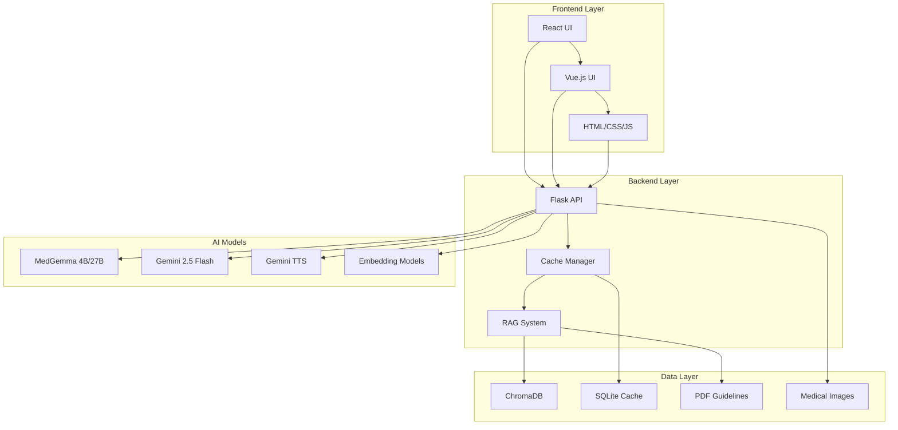

# 🏥 Pruebas del IMSS - Suite de Aplicaciones de IA Médica

## 📋 Descripción General

Esta suite de aplicaciones médicas desarrollada para el IMSS (Instituto Mexicano del Seguro Social) demuestra el potencial de la Inteligencia Artificial en la educación y práctica médica. Los tres proyectos principales utilizan modelos de IA especializados en medicina para crear experiencias de aprendizaje interactivas y herramientas de apoyo clínico.

---

## 🎯 Proyectos Incluidos

### 1. 📚 **Educación Radiológica** (`Educacion_radiografia/`)
**Sistema de Aprendizaje Interactivo con MedGemma**

### 2. 🫁 **Radiografías de Tórax** (`radiografias_torax/`)
**Compañero de Aprendizaje Radiológico con RAG**

### 3. 🎭 **Simulación de Entrevistas** (`Simulacion/`)
**Simulador de Entrevistas Pre-visita con MedGemma**

---

## 🏗️ Arquitectura General de la Suite



---

# 📚 Proyecto 1: Educación Radiológica

## 🎯 Propósito
Sistema educativo interactivo que utiliza MedGemma para explicar términos médicos y hallazgos radiológicos mediante análisis multimodal de imágenes médicas y reportes.

## 🏗️ Arquitectura Técnica

### **Backend (Flask)**
```
Educacion_radiografia/
├── app.py                 # Servidor principal Flask
├── routes.py              # Endpoints de la API
├── config.py              # Configuración de la aplicación
├── llm_client.py          # Cliente para MedGemma remoto
├── local_llm_client.py    # Cliente para MedGemma local (LM Studio)
├── utils.py               # Utilidades de procesamiento
├── cache_store.py         # Sistema de caché con diskcache
└── requirements.txt       # Dependencias Python
```

### **Frontend (HTML/CSS/JS)**
```
Educacion_radiografia/
├── templates/
│   └── index.html         # Interfaz principal
├── static/
│   ├── css/style.css      # Estilos responsivos
│   ├── js/demo.js         # Lógica de interactividad
│   ├── images/            # Imágenes radiológicas (6 casos)
│   └── reports/           # Reportes de texto correspondientes
└── static/reports_manifest.csv  # Configuración de casos
```

## 🔧 Características Principales

### **Funcionalidades del Sistema**
- ✅ **Análisis Multimodal**: Combina análisis de texto e imagen
- ✅ **Interfaz Interactiva**: Texto clickeable para explicaciones
- ✅ **Cache Inteligente**: Optimización de respuestas frecuentes
- ✅ **Casos Preconfigurados**: 6 casos de estudio (CT y CXR)
- ✅ **Explicaciones Dinámicas**: Panel flotante con explicaciones en tiempo real

### **Casos de Estudio Incluidos**
| Tipo | Caso | Descripción |
|------|------|-------------|
| CT | Tumor | Caso de tumor en tomografía computarizada |
| CXR | Effusion | Derrame pleural en radiografía de tórax |
| CXR | Infection | Infección pulmonar |
| CXR | Lymphadenopathy | Linfadenopatía |
| CXR | Nodule A | Nódulo pulmonar (caso A) |
| CXR | Nodule B | Nódulo pulmonar (caso B) |

## 🔄 Flujo de Trabajo

1. **Inicialización**: Carga de configuración y cliente LLM
2. **Selección de Caso**: Usuario selecciona caso desde pestañas
3. **Interacción Educativa**: Click en oraciones para explicaciones
4. **Procesamiento**: MedGemma analiza imagen + texto
5. **Visualización**: Explicación contextualizada en panel flotante

## 🌐 API Endpoints

- `GET /` - Página principal con selección de casos
- `GET /get_report_details/<report_name>` - Detalles de reporte específico
- `POST /explain` - Genera explicación para oración específica
- `GET /download_cache` - Descarga caché como ZIP

---

# 🫁 Proyecto 2: Radiografías de Tórax

## 🎯 Propósito
Compañero de aprendizaje radiológico que utiliza MedGemma multimodal con sistema RAG para crear experiencias educativas interactivas con radiografías de tórax.

## 🏗️ Arquitectura Técnica

### **Backend (Flask + RAG)**
```
radiografias_torax/backend/
├── app.py                    # Servidor principal
├── config.py                 # Configuración y variables de entorno
├── routes.py                 # Endpoints de la API
├── cache_manager.py          # Gestión de caché persistente
├── case_util.py              # Utilidades para manejo de casos
├── llm_client.py             # Cliente MedGemma
├── local_llm_client.py       # Cliente local
├── background_task_manager.py # Gestor de tareas en background
├── rag/                      # Sistema RAG
│   ├── knowledge_base.py     # Base de conocimiento
│   ├── model_manager.py      # Gestión de modelos
│   ├── rag_context_engine.py # Motor de recuperación
│   └── siglip_embedder.py    # Embeddings para imágenes
└── data/                     # Datos médicos
    ├── reports_manifest.csv  # Metadatos de casos
    ├── reports/              # Reportes individuales
    └── who_chestxray_guideline_9241546778_eng.pdf
```

### **Frontend (React + Vite)**
```
radiografias_torax/frontend/
├── src/
│   ├── App.jsx               # Componente principal
│   ├── screens/              # Pantallas principales
│   │   ├── LandingScreen.jsx
│   │   ├── JourneySelectionScreen.jsx
│   │   ├── ChatScreen.jsx
│   │   └── SummaryScreen.jsx
│   ├── components/           # Componentes reutilizables
│   │   ├── ChatMessage.jsx
│   │   ├── MCQOption.jsx
│   │   └── DetailsOverlay.jsx
│   └── utils/                # Utilidades frontend
└── package.json
```

## 🔧 Características Principales

### **Sistema RAG Avanzado**
- ✅ **Base de Conocimiento**: Guías clínicas de la OMS
- ✅ **Embeddings Multimodales**: Jina para texto + SigLIP para imágenes
- ✅ **Recuperación Contextual**: Contexto relevante por caso
- ✅ **ChromaDB**: Almacenamiento vectorial persistente

### **Experiencia de Aprendizaje**
- ✅ **Preguntas MCQ**: Generación automática de preguntas educativas
- ✅ **Análisis Multimodal**: MedGemma analiza imagen + contexto
- ✅ **Feedback Inmediato**: Evaluación y explicaciones en tiempo real
- ✅ **Resumen Personalizado**: Análisis final del aprendizaje

### **Sistema de Cache Inteligente**
- ✅ **Persistencia**: Almacenamiento en disco con DiskCache
- ✅ **Optimización**: Evita regeneración de preguntas
- ✅ **Eficiencia**: Respuestas instantáneas para casos conocidos

## 🔄 Flujo de Funcionamiento

1. **Inicialización**: Carga de casos y sistema RAG en background
2. **Selección de Caso**: Usuario elige radiografía de tórax
3. **Generación de Preguntas**: Sistema crea MCQ basadas en:
   - Imagen de la radiografía
   - Guías clínicas (RAG)
   - Contexto médico relevante
4. **Interacción**: Usuario responde preguntas
5. **Análisis**: MedGemma evalúa respuestas
6. **Resumen**: Generación de análisis educativo personalizado

## 🌐 API Endpoints

- `GET /api/case/stub` - Lista de casos disponibles
- `GET /api/case/<case_id>/stub` - Detalles de caso específico
- `GET /api/case/<case_id>/all-questions` - Genera preguntas MCQ
- `POST /api/case/<case_id>/summarize` - Genera resumen de aprendizaje
- `GET /app/download_cache` - Descarga caché del sistema

---

# 🎭 Proyecto 3: Simulación de Entrevistas

## 🎯 Propósito
Sistema de simulación de entrevistas médicas pre-visita que utiliza MedGemma como entrevistador y Gemini como paciente virtual para generar reportes clínicos estructurados.

## 🏗️ Arquitectura Técnica

### **Backend (Flask + Multi-LLM)**
```
Simulacion/
├── app.py                    # Servidor Flask principal
├── interview_simulator.py    # Lógica de simulación
├── medgemma.py              # Cliente MedGemma (Vertex AI)
├── gemini.py                # Cliente Gemini API
├── gemini_tts.py            # Cliente síntesis de voz
├── local_llm_client.py      # Cliente modelos locales
├── evaluation.py            # Evaluación de reportes
├── cache.py                 # Sistema de caché persistente
├── auth.py                  # Autenticación GCP
└── data/                    # Datos de pacientes y síntomas
    ├── symptoms.json        # Base de datos de síntomas
    ├── patients_and_conditions.json
    └── report_template.txt
```

### **Frontend (React)**
```
Simulacion/frontend/
├── src/
│   ├── components/
│   │   ├── WelcomePage/     # Página de bienvenida
│   │   ├── PatientBuilder/  # Selector de pacientes
│   │   ├── Interview/       # Interfaz de entrevista
│   │   ├── RolePlayDialogs/ # Explicación del proceso
│   │   └── DetailsPopup/    # Información técnica
│   └── App.js
└── package.json
```

## 🔧 Características Principales

### **Simulación de Entrevistas**
- ✅ **Entrevistador IA**: MedGemma actúa como asistente clínico
- ✅ **Paciente Virtual**: Gemini simula respuestas de paciente
- ✅ **Síntesis de Voz**: Audio generado con Gemini TTS
- ✅ **Reportes Estructurados**: Generación automática de documentación médica

### **Sistema de Pacientes**
- ✅ **3 Pacientes Virtuales**: Jordon, Alex, Sacha
- ✅ **4 Condiciones Médicas**: Gripe, Malaria, Migraña, Síndrome de Serotonina
- ✅ **Registros FHIR**: Datos médicos sintéticos estructurados
- ✅ **Síntomas Contextuales**: Base de datos de síntomas por condición

### **Características Técnicas Avanzadas**
- ✅ **Streaming en Tiempo Real**: Server-Sent Events (SSE)
- ✅ **Cache Inteligente**: Reducción de costos de API
- ✅ **Procesamiento Secuencial**: Cola de mensajes ordenada
- ✅ **Diff Visual**: Cambios incrementales en reportes
- ✅ **Evaluación Automática**: Análisis de calidad de reportes

## 🔄 Flujo de Trabajo Completo

1. **Bienvenida**: Usuario lee descripción del demo
2. **Selección**: Usuario elige paciente y condición médica
3. **Simulación de Entrevista**:
   - MedGemma (entrevistador) hace preguntas clínicas
   - Gemini (paciente) responde naturalmente
   - Sistema genera audio con TTS
   - Reporte se actualiza en tiempo real
4. **Evaluación**: Análisis de calidad del reporte generado

## 🤖 Modelos de IA Utilizados

### **MedGemma 27B (Text-IT)**
- **Rol**: Asistente clínico entrevistador y redactor
- **Proveedor**: Google Health AI (Vertex AI)
- **Funciones**: Preguntas clínicas, redacción de reportes, evaluación

### **Gemini 2.5 Flash**
- **Rol**: Paciente virtual
- **Proveedor**: Google AI
- **Funciones**: Respuestas naturales como paciente

### **Gemini TTS**
- **Rol**: Síntesis de voz
- **Modelo**: gemini-2.5-flash-preview-tts
- **Funciones**: Audio para entrevistador y paciente

## 🌐 API Endpoints

- `GET /` - Página principal
- `GET /api/stream_conversation` - Streaming de entrevista (SSE)
- `POST /api/evaluate_report` - Evaluación de reporte
- `GET /api/download_cache` - Descarga de caché

---

# 🚀 Instalación y Configuración

## 📋 Requisitos del Sistema

### **Requisitos Generales**
- Python 3.11+
- Node.js 18+ (para frontend)
- Docker (opcional)
- LM Studio (para MedGemma local)

### **APIs Requeridas**
- Google Gemini API Key
- Google Cloud Platform (para MedGemma)
- LM Studio (alternativa local)

## 🔧 Configuración por Proyecto

### **1. Educación Radiológica**

```bash
# Instalación
cd Educacion_radiografia
pip install -r requirements.txt

# Configuración LM Studio
# 1. Instalar LM Studio
# 2. Cargar modelo MedGemma-4B
# 3. Iniciar servidor en localhost:1234

# Ejecución
python app.py
# Acceder a http://localhost:7860
```

### **2. Radiografías de Tórax**

```bash
# Instalación
cd radiografias_torax
pip install -r requirements.txt
cd frontend && npm install && npm run build && cd ..

# Configuración
cp env.list.example env.list
# Editar variables de entorno

# Ejecución
./run_local.sh
# Acceder a http://localhost:7860
```

### **3. Simulación de Entrevistas**

```bash
# Instalación
cd Simulacion
pip install -r requirements.txt
cd frontend && npm install && npm run build && cd ..

# Configuración
# Crear archivo env.list con credenciales
GEMINI_API_KEY="tu-api-key"
GCP_MEDGEMMA_ENDPOINT="tu-endpoint"
GCP_MEDGEMMA_SERVICE_ACCOUNT_KEY='{"type": "service_account", ...}'

# Ejecución
python app.py
# Acceder a http://localhost:7860
```

## 🐳 Despliegue con Docker

### **Docker Compose (Recomendado)**
```bash
# En la raíz del proyecto
docker-compose up -d
```

### **Docker Individual**
```bash
# Para cada proyecto
docker build -t proyecto-nombre .
docker run -p 7860:7860 --env-file env.list proyecto-nombre
```

---

# 📊 Características Técnicas Comunes

## 🧠 Modelos de IA Utilizados

| Modelo | Proyecto | Uso Principal | Proveedor |
|--------|----------|---------------|-----------|
| MedGemma 4B | Educación Radiológica | Análisis multimodal | LM Studio |
| MedGemma 27B | Radiografías + Simulación | Razonamiento clínico | Vertex AI |
| Gemini 2.5 Flash | Simulación | Paciente virtual | Google AI |
| Gemini TTS | Simulación | Síntesis de voz | Google AI |
| Jina Embeddings | Radiografías | Embeddings de texto | Jina AI |
| SigLIP | Radiografías | Embeddings de imagen | Google |

## 💾 Sistemas de Almacenamiento

### **Cache Persistente**
- **Tecnología**: DiskCache
- **Propósito**: Optimización de respuestas de IA
- **Beneficios**: Reducción de costos, respuestas instantáneas

### **Base de Conocimiento Vectorial**
- **Tecnología**: ChromaDB
- **Propósito**: Almacenamiento de embeddings médicos
- **Contenido**: Guías clínicas, reportes médicos

### **Datos Médicos**
- **Formatos**: PDF, JSON, CSV, imágenes DICOM
- **Contenido**: Guías OMS, casos de estudio, registros FHIR

## 🔄 Patrones de Arquitectura

### **1. Patrón RAG (Retrieval-Augmented Generation)**
- **Implementación**: Sistema de recuperación de contexto
- **Beneficio**: Respuestas más precisas y contextualizadas
- **Uso**: Proyecto de Radiografías de Tórax

### **2. Patrón Multimodal**
- **Implementación**: Análisis conjunto de texto e imagen
- **Beneficio**: Comprensión más completa del contexto médico
- **Uso**: Todos los proyectos

### **3. Patrón de Streaming**
- **Implementación**: Server-Sent Events (SSE)
- **Beneficio**: Experiencia de usuario en tiempo real
- **Uso**: Proyecto de Simulación de Entrevistas

### **4. Patrón de Cache Inteligente**
- **Implementación**: Cache persistente con memoización
- **Beneficio**: Optimización de rendimiento y costos
- **Uso**: Todos los proyectos

---

# 🎯 Casos de Uso y Aplicaciones

## 👨‍⚕️ Para Profesionales Médicos

### **Educación Continua**
- Aprendizaje interactivo de interpretación radiológica
- Acceso a guías clínicas contextualizadas
- Evaluación de conocimientos con feedback inmediato

### **Entrenamiento Clínico**
- Simulación de entrevistas médicas
- Práctica de redacción de reportes
- Evaluación de habilidades de comunicación

## 🎓 Para Estudiantes de Medicina

### **Aprendizaje Interactivo**
- Experiencias de aprendizaje gamificadas
- Acceso a casos de estudio reales
- Feedback personalizado y explicaciones detalladas

### **Preparación para Exámenes**
- Preguntas de opción múltiple contextualizadas
- Análisis de casos complejos
- Evaluación de progreso de aprendizaje

## 🔬 Para Investigadores

### **Desarrollo de IA Médica**
- Ejemplos de implementación de modelos multimodales
- Integración de sistemas RAG en medicina
- Arquitecturas escalables para aplicaciones médicas

### **Análisis de Datos Médicos**
- Procesamiento de imágenes radiológicas
- Análisis de reportes médicos
- Extracción de conocimiento clínico

---

# 🔒 Consideraciones de Seguridad y Ética

## ⚠️ Descargos de Responsabilidad

### **Uso Educativo Únicamente**
- Estas aplicaciones son solo para fines educativos y demostrativos
- No representan productos terminados o aprobados
- No deben usarse para diagnóstico o tratamiento médico real

### **Cumplimiento Regulatorio**
- No cumplen con regulaciones armonizadas de calidad, seguridad o eficacia
- Cualquier aplicación del mundo real requeriría desarrollo adicional
- Necesitarían validación clínica y aprobación regulatoria

### **Protección de Datos**
- Los datos utilizados son sintéticos o de demostración
- No se procesan datos médicos reales de pacientes
- Se implementan medidas de privacidad y seguridad

## 🛡️ Medidas de Seguridad Implementadas

### **Aislamiento de Datos**
- Datos de demostración separados de datos reales
- Cache local sin transmisión de datos sensibles
- Validación de entrada para prevenir inyecciones

### **Control de Acceso**
- APIs protegidas con autenticación
- Validación de permisos en endpoints sensibles
- Logs de auditoría para seguimiento de uso

---

# 📈 Métricas y Rendimiento

## ⚡ Rendimiento por Proyecto

### **Educación Radiológica**
- **Tiempo de respuesta**: <2s (con cache)
- **Casos disponibles**: 6 casos preconfigurados
- **Uso de memoria**: ~500MB
- **Tamaño de cache**: ~50MB

### **Radiografías de Tórax**
- **Generación de preguntas**: 5-10s (primera vez)
- **Respuesta con cache**: <0.1s
- **Casos disponibles**: 2+ casos configurables
- **Tamaño de base de conocimiento**: ~100MB

### **Simulación de Entrevistas**
- **Duración de entrevista**: ~2-3 minutos
- **Tiempo de generación de audio**: 1-2s por mensaje
- **Pacientes disponibles**: 3 pacientes virtuales
- **Condiciones médicas**: 4 condiciones simuladas

## 💰 Optimización de Costos

### **Sistema de Cache**
- **Reducción de llamadas API**: 80-90%
- **Ahorro de costos**: $50-100 por 100 sesiones
- **Tiempo de respuesta**: Mejora de 10x

### **Modelos Eficientes**
- **MedGemma 4B**: Balance óptimo rendimiento/costo
- **Gemini 2.5 Flash**: Respuestas rápidas y económicas
- **Embeddings locales**: Reducción de dependencias externas

---

# 🚀 Roadmap y Mejoras Futuras

## 📅 Próximas Características

### **Corto Plazo (3-6 meses)**
- [ ] Soporte para más tipos de imágenes médicas (MRI, CT, Ultrasound)
- [ ] Integración con sistemas DICOM reales
- [ ] Interfaz de usuario mejorada y más intuitiva
- [ ] Soporte para múltiples idiomas

### **Mediano Plazo (6-12 meses)**
- [ ] Integración con sistemas EHR reales
- [ ] Análisis de progreso de aprendizaje
- [ ] Sistema de certificación y badges
- [ ] API pública para desarrolladores

### **Largo Plazo (1-2 años)**
- [ ] Modelos de IA especializados por especialidad médica
- [ ] Integración con realidad virtual/aumentada
- [ ] Análisis predictivo de casos médicos
- [ ] Plataforma de colaboración entre instituciones

## 🔧 Mejoras Técnicas Planificadas

### **Arquitectura**
- [ ] Microservicios para mejor escalabilidad
- [ ] Kubernetes para orquestación de contenedores
- [ ] CDN para distribución global de contenido
- [ ] Base de datos distribuida para alta disponibilidad

### **IA y Machine Learning**
- [ ] Fine-tuning de modelos con datos específicos del IMSS
- [ ] Implementación de modelos de ensemble
- [ ] Análisis de sentimientos en reportes médicos
- [ ] Detección automática de anomalías

### **Seguridad y Cumplimiento**
- [ ] Encriptación end-to-end
- [ ] Cumplimiento con estándares HIPAA
- [ ] Auditoría de seguridad automatizada
- [ ] Certificaciones de seguridad médica

---

# 📚 Documentación Técnica Adicional

## 🔗 Enlaces Útiles

### **Documentación de Modelos**
- [MedGemma en HuggingFace](https://huggingface.co/collections/google/medgemma-release-680aade845f90bec6a3f60c4)
- [MedGemma DevSite](https://developers.google.com/health-ai-developer-foundations/medgemma)
- [Gemini API Documentation](https://ai.google.dev/docs)

### **Tecnologías Utilizadas**
- [Flask Documentation](https://flask.palletsprojects.com/)
- [React Documentation](https://react.dev/)
- [ChromaDB Documentation](https://docs.trychroma.com/)
- [DiskCache Documentation](https://grantjenks.com/docs/diskcache/)

### **Estándares Médicos**
- [FHIR Specification](https://hl7.org/fhir/)
- [DICOM Standard](https://www.dicomstandard.org/)
- [WHO Clinical Guidelines](https://www.who.int/publications/guidelines)

## 📖 Guías de Desarrollo

### **Para Desarrolladores**
- [Guía de Contribución](CONTRIBUTING.md)
- [Estándares de Código](CODING_STANDARDS.md)
- [Guía de Testing](TESTING_GUIDE.md)
- [Documentación de API](API_DOCUMENTATION.md)

### **Para Administradores**
- [Guía de Despliegue](DEPLOYMENT_GUIDE.md)
- [Guía de Monitoreo](MONITORING_GUIDE.md)
- [Guía de Resolución de Problemas](TROUBLESHOOTING.md)
- [Guía de Backup y Recuperación](BACKUP_GUIDE.md)

---

# 📞 Soporte y Contacto

## 🆘 Soporte Técnico

### **Issues y Bugs**
- Crear issue en el repositorio del proyecto
- Incluir logs de error y pasos para reproducir
- Especificar versión y configuración del sistema

### **Consultas Generales**
- Email: soporte-tecnico@imss.gob.mx
- Documentación: [Wiki del Proyecto](https://github.com/imss/ai-medical-suite/wiki)
- Foro de la Comunidad: [Discusiones](https://github.com/imss/ai-medical-suite/discussions)

## 👥 Equipo de Desarrollo

### **Líderes del Proyecto**
- **Arquitecto Principal**: [Nombre del Arquitecto]
- **Líder de IA**: [Nombre del Líder de IA]
- **Líder de Frontend**: [Nombre del Líder Frontend]
- **Líder de Backend**: [Nombre del Líder Backend]

### **Colaboradores**
- Equipo de Desarrollo del IMSS
- Consultores de IA Médica
- Especialistas en Radiología
- Desarrolladores de la Comunidad

---

# 📄 Licencia y Términos

## 📜 Licencia del Proyecto

```
Copyright 2025 Instituto Mexicano del Seguro Social (IMSS)

Licensed under the Apache License, Version 2.0 (the "License");
you may not use this file except in compliance with the License.
You may obtain a copy of the License at

    http://www.apache.org/licenses/LICENSE-2.0

Unless required by applicable law or agreed to in writing, software
distributed under the License is distributed on an "AS IS" BASIS,
WITHOUT WARRANTIES OR CONDITIONS OF ANY KIND, either express or implied.
See the License for the specific language governing permissions and
limitations under the License.
```

## ⚖️ Términos de Uso

### **Uso Permitido**
- Fines educativos y de investigación
- Desarrollo de aplicaciones médicas
- Mejora y personalización del código

### **Restricciones**
- No uso comercial sin autorización
- No modificación de licencias
- Cumplimiento de regulaciones médicas locales

---

# 🏆 Reconocimientos

## 🙏 Agradecimientos

### **Instituciones**
- **IMSS**: Por el apoyo y recursos para el desarrollo
- **Google Health AI**: Por los modelos MedGemma y Gemini
- **Comunidad Open Source**: Por las tecnologías base utilizadas

### **Colaboradores Especiales**
- Equipo de Radiología del IMSS
- Especialistas en IA Médica
- Desarrolladores de la comunidad médica
- Beta testers y usuarios tempranos

---

**📅 Última actualización**: Enero 2025  
**📝 Versión del documento**: 1.0  
**👨‍💻 Mantenido por**: Equipo de Desarrollo IMSS  
**🔄 Estado del proyecto**: Activo en desarrollo

---

*Este documento proporciona una visión completa de la suite de aplicaciones de IA médica desarrollada para el IMSS. Para información más específica sobre cada proyecto, consulte los README individuales en cada directorio.*
