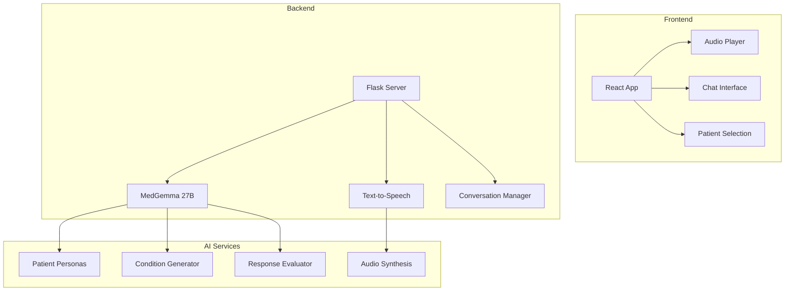

# 🎭 Simulación de Entrevistas Médicas IMSS

## 📋 Descripción

Sistema de simulación de entrevistas pre-visita que permite a estudiantes de medicina y profesionales de la salud practicar sus habilidades de comunicación clínica con pacientes virtuales. Utiliza IA avanzada para crear conversaciones realistas, síntesis de voz y evaluaciones automáticas del desempeño.

## 🏗️ Arquitectura



## 🚀 Características Principales

### **Pacientes Virtuales Realistas**
- Múltiples perfiles de pacientes
- Condiciones médicas específicas
- Personalidades y comportamientos únicos
- Historiales médicos detallados

### **Entrevistas Interactivas**
- Conversación en tiempo real
- Síntesis de voz natural
- Respuestas contextuales inteligentes
- Adaptación al estilo del entrevistador

### **Sistema de Evaluación**
- Análisis automático de respuestas
- Puntuación de habilidades clínicas
- Feedback detallado y constructivo
- Identificación de áreas de mejora

### **Múltiples Escenarios**
- Consulta de primera vez
- Seguimiento de tratamiento
- Emergencias médicas
- Casos de especialidad

## 🛠️ Tecnologías Utilizadas

- **Frontend**: React + JavaScript + CSS3
- **Backend**: Flask + Python 3.8+
- **IA**: Google MedGemma 27B + LangChain
- **Audio**: Text-to-Speech (TTS)
- **API**: RESTful + Server-Sent Events
- **Estado**: React Hooks + Context

## 📦 Instalación

### **Prerrequisitos:**
```bash
Python 3.8+
Node.js 18+
npm o yarn
```

### **Instalación Backend:**
```bash
cd Simulacion
pip install -r requirements.txt
```

### **Instalación Frontend:**
```bash
cd Simulacion/frontend
npm install
```

### **Configuración:**
```bash
# Variables de entorno
export MEDGEMMA_ENDPOINT=your_endpoint_here
export TTS_SERVICE_URL=your_tts_service
export CONVERSATION_TIMEOUT=300
```

## 🚀 Ejecución

### **Desarrollo (Backend):**
```bash
python app.py
```

### **Desarrollo (Frontend):**
```bash
cd frontend
npm start
```

### **Producción:**
```bash
# Compilar frontend
cd frontend
npm run build

# Ejecutar backend
python app.py
```

### **Con Docker:**
```bash
docker-compose up -d
```

## 📡 API Endpoints

### **GET /api/health**
Verificar estado del servicio.

**Response:**
```json
{
  "status": "healthy",
  "timestamp": "2024-01-01T00:00:00Z",
  "patients_available": 5,
  "tts_ready": true
}
```

### **GET /api/patients**
Obtener lista de pacientes virtuales disponibles.

**Response:**
```json
{
  "patients": [
    {
      "id": "patient_001",
      "name": "María González",
      "age": 45,
      "condition": "diabetes_type_2",
      "difficulty": "intermediate",
      "description": "Paciente con diabetes tipo 2 que acude por control..."
    }
  ]
}
```

### **POST /api/start_conversation**
Iniciar nueva conversación con paciente.

**Request:**
```json
{
  "patient_id": "patient_001",
  "scenario": "routine_checkup",
  "student_id": "optional"
}
```

**Response:**
```json
{
  "conversation_id": "uuid",
  "patient_info": {
    "name": "María González",
    "age": 45,
    "chief_complaint": "Me siento muy cansada últimamente"
  },
  "instructions": "Realiza una entrevista médica completa..."
}
```

### **POST /api/stream_conversation**
Streaming de conversación en tiempo real.

**Request:**
```json
{
  "conversation_id": "uuid",
  "message": "Hola María, ¿cómo se siente hoy?",
  "audio_enabled": true
}
```

**Response:** Server-Sent Events (SSE)
```json
{
  "type": "patient_response",
  "text": "Hola doctor, me siento muy cansada...",
  "audio_url": "https://...",
  "timestamp": "2024-01-01T00:00:00Z"
}
```

### **POST /api/evaluate_response**
Evaluar respuesta del estudiante.

**Request:**
```json
{
  "conversation_id": "uuid",
  "student_response": "¿Desde cuándo se siente cansada?",
  "context": "opening_questions"
}
```

**Response:**
```json
{
  "evaluation": {
    "score": 8.5,
    "feedback": "Excelente pregunta abierta. Considera también preguntar sobre el sueño.",
    "suggestions": [
      "Pregunta sobre patrones de sueño",
      "Investiga sobre cambios en el apetito"
    ],
    "clinical_skills": {
      "communication": 9,
      "history_taking": 8,
      "empathy": 8.5
    }
  }
}
```

## 🎭 Pacientes Virtuales

### **Perfiles Disponibles:**

#### **María González (45 años)**
- **Condición**: Diabetes tipo 2
- **Dificultad**: Intermedia
- **Características**: Ansiosa, pregunta mucho, necesita tranquilidad

#### **Carlos Rodríguez (67 años)**
- **Condición**: Hipertensión arterial
- **Dificultad**: Básica
- **Características**: Cooperativo, historial médico extenso

#### **Ana Martínez (28 años)**
- **Condición**: Embarazo de alto riesgo
- **Dificultad**: Avanzada
- **Características**: Preocupada, múltiples síntomas

### **Escenarios de Entrevista:**
- **Consulta de primera vez**
- **Seguimiento de tratamiento**
- **Emergencia médica**
- **Consulta de especialidad**
- **Entrevista familiar**

## 🎯 Sistema de Evaluación

### **Criterios de Evaluación:**
- **Comunicación**: Claridad, empatía, profesionalismo
- **Historia Clínica**: Preguntas relevantes, secuencia lógica
- **Habilidades Clínicas**: Técnica de entrevista, observación
- **Manejo de Situaciones**: Crisis, pacientes difíciles

### **Puntuación:**
- **Excelente**: 9-10 puntos
- **Bueno**: 7-8.9 puntos
- **Satisfactorio**: 5-6.9 puntos
- **Necesita Mejora**: <5 puntos

### **Feedback Automático:**
- Identificación de fortalezas
- Áreas de oportunidad específicas
- Sugerencias de mejora
- Recursos de aprendizaje

## 🔧 Configuración Avanzada

### **Configuración de Pacientes:**
```python
PATIENT_CONFIG = {
    "max_conversation_length": 50,
    "response_timeout": 30,
    "audio_quality": "high",
    "personality_consistency": True
}
```

### **Configuración de TTS:**
```python
TTS_CONFIG = {
    "voice": "es-MX-Female",
    "speed": 1.0,
    "pitch": 1.0,
    "emotion": "neutral"
}
```

### **Configuración de Evaluación:**
```python
EVALUATION_CONFIG = {
    "criteria_weights": {
        "communication": 0.3,
        "history_taking": 0.4,
        "clinical_skills": 0.3
    },
    "feedback_detail": "comprehensive",
    "suggestions_count": 3
}
```

## 📊 Monitoreo y Analytics

### **Métricas de Uso:**
- Número de conversaciones por día
- Tiempo promedio por entrevista
- Puntuaciones promedio por habilidad
- Patrones de error comunes

### **Logs del Sistema:**
```bash
# Ver logs en tiempo real
tail -f logs/simulacion.log

# Logs de conversaciones
grep "conversation" logs/simulacion.log

# Logs de evaluaciones
grep "evaluation" logs/simulacion.log
```

## 🧪 Testing

### **Tests Unitarios:**
```bash
pytest tests/unit/
```

### **Tests de Integración:**
```bash
pytest tests/integration/
```

### **Tests de Conversación:**
```bash
pytest tests/conversation/
```

## 🔒 Seguridad y Privacidad

### **Protección de Datos:**
- No almacenamiento de datos personales reales
- Anonimización de conversaciones
- Cumplimiento con LFPDPPP
- Encriptación de audio

### **Validación de Contenido:**
- Filtrado de contenido inapropiado
- Validación de respuestas médicas
- Revisión por expertos clínicos
- Actualización regular de casos

## 📈 Roadmap

### **Versión 1.1:**
- [ ] Más perfiles de pacientes
- [ ] Integración con video
- [ ] Análisis de lenguaje corporal
- [ ] Sistema de competencias

### **Versión 1.2:**
- [ ] Realidad virtual
- [ ] Entrevistas multijugador
- [ ] Integración con LMS
- [ ] Certificación de habilidades

## 🎯 Casos de Uso

### **Para Estudiantes de Medicina:**
- Práctica de habilidades de comunicación
- Desarrollo de confianza clínica
- Aprendizaje de técnicas de entrevista
- Preparación para exámenes prácticos

### **Para Residentes:**
- Refinamiento de habilidades avanzadas
- Manejo de situaciones complejas
- Preparación para especialización
- Evaluación de competencias

### **Para Profesores:**
- Herramienta de evaluación
- Generación de casos personalizados
- Seguimiento del progreso estudiantil
- Recursos de enseñanza

## 🤝 Contribuir

1. Fork del repositorio
2. Crear rama feature (`git checkout -b feature/nueva-funcionalidad`)
3. Commit cambios (`git commit -m 'Agregar nueva funcionalidad'`)
4. Push a la rama (`git push origin feature/nueva-funcionalidad`)
5. Crear Pull Request

## 📄 Licencia

Este proyecto está bajo la licencia MIT. Ver `LICENSE` para más detalles.

## 📞 Soporte

- **Issues**: Reportar problemas en el repositorio
- **Documentación**: Ver documentación completa en `/docs`
- **Email**: [simulacion@imss.ai]

---

*Simulando el futuro de la medicina con IA*