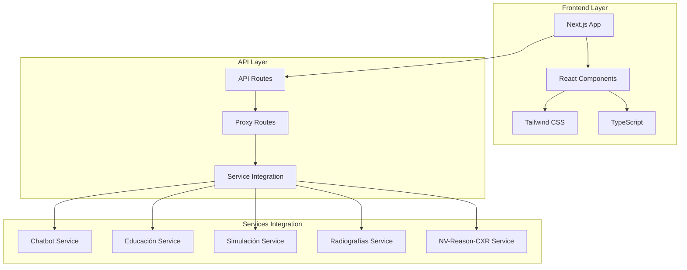

# 🌐 Gateway Principal IMSS

## 📋 Descripción

Gateway principal y punto de entrada unificado para la Suite IMSS de Inteligencia Artificial Médica. Proporciona una interfaz web moderna, navegación integrada entre servicios y páginas informativas detalladas sobre las capacidades de la plataforma.

## 🏗️ Arquitectura



## 🚀 Características Principales

### **Dashboard Unificado**
- Vista general de todos los servicios
- Navegación intuitiva entre módulos
- Estado de servicios en tiempo real
- Acceso rápido a funcionalidades

### **Páginas Informativas**
- **Características Principales**: Descripción detallada de capacidades
- **Experiencia Profesional**: Casos de uso y aplicaciones
- **Integraciones**: Tecnologías y modelos utilizados
- **Mejores Prácticas**: Guías de uso responsable
- **Legal**: Términos, licencias y descargos

### **Integración de Servicios**
- Proxy transparente a servicios backend
- Manejo de errores centralizado
- Autenticación unificada (futuro)
- Monitoreo de estado de servicios

### **Diseño Responsivo**
- Optimizado para desktop y móvil
- Interfaz moderna y profesional
- Accesibilidad mejorada
- Navegación intuitiva

## 🛠️ Tecnologías Utilizadas

- **Framework**: Next.js 14 + React 18
- **Lenguaje**: TypeScript
- **Estilos**: Tailwind CSS
- **Componentes**: shadcn/ui
- **API**: Next.js API Routes
- **Deployment**: Vercel/Docker

## 📦 Instalación

### **Prerrequisitos:**
```bash
Node.js 18+
npm o yarn
```

### **Instalación:**
```bash
cd UI_IMSS
npm install
```

### **Configuración:**
```bash
# Variables de entorno
cp .env.example .env.local

# Configurar URLs de servicios
NEXT_PUBLIC_CHATBOT_URL=http://localhost:5001
NEXT_PUBLIC_EDUCACION_URL=http://localhost:5002
NEXT_PUBLIC_SIMULACION_URL=http://localhost:5003
NEXT_PUBLIC_RADIOGRAFIAS_URL=http://localhost:5004
NEXT_PUBLIC_NV_REASON_CXR_URL=http://localhost:5005
```

## 🚀 Ejecución

### **Desarrollo:**
```bash
npm run dev
```

### **Producción:**
```bash
npm run build
npm start
```

### **Con Docker:**
```bash
docker build -t ui-imss .
docker run -p 3000:3000 ui-imss
```

## 📡 API Routes

### **GET /api/health**
Verificar estado del gateway y servicios.

**Response:**
```json
{
  "gateway": "healthy",
  "services": {
    "chatbot": "healthy",
    "educacion": "healthy",
    "simulacion": "healthy",
    "radiografias": "healthy",
    "nv-reason-cxr": "healthy"
  },
  "timestamp": "2024-01-01T00:00:00Z"
}
```

### **POST /api/proxy/[...path]**
Proxy transparente a servicios backend.

**Request:**
```json
{
  "service": "chatbot",
  "endpoint": "api/chat",
  "method": "POST",
  "data": {
    "message": "Hola, ¿cómo estás?"
  }
}
```

**Response:**
```json
{
  "response": "Hola, soy el chatbot médico...",
  "status": "success"
}
```

## 🎨 Páginas y Componentes

### **Páginas Principales:**
- **/** - Dashboard principal
- **/caracteristicas-principales** - Características de la plataforma
- **/experiencia-profesional** - Casos de uso profesionales
- **/integraciones** - Tecnologías y modelos utilizados
- **/mejores-practicas** - Guías de uso responsable
- **/legal** - Términos y licencias
- **/blog** - Artículos y noticias
- **/casos-de-estudio** - Casos de estudio
- **/historias-de-clientes** - Testimonios
- **/contacto** - Información de contacto
- **/soporte-tecnico** - Soporte y ayuda

### **Componentes Reutilizables:**
- **Header** - Navegación principal
- **Footer** - Enlaces y información
- **ServiceCard** - Tarjetas de servicios
- **FeatureCard** - Tarjetas de características
- **Button** - Botones estilizados
- **Layout** - Layout base de páginas

## 🔧 Configuración Avanzada

### **Configuración de Next.js:**
```javascript
// next.config.mjs
const nextConfig = {
  experimental: {
    appDir: true,
  },
  images: {
    domains: ['localhost'],
  },
  env: {
    CUSTOM_KEY: process.env.CUSTOM_KEY,
  },
}
```

### **Configuración de Tailwind:**
```javascript
// tailwind.config.js
module.exports = {
  content: [
    './pages/**/*.{js,ts,jsx,tsx}',
    './components/**/*.{js,ts,jsx,tsx}',
    './app/**/*.{js,ts,jsx,tsx}',
  ],
  theme: {
    extend: {
      colors: {
        'imss-green': '#068959',
      },
    },
  },
}
```

### **Configuración de TypeScript:**
```json
{
  "compilerOptions": {
    "target": "es5",
    "lib": ["dom", "dom.iterable", "es6"],
    "allowJs": true,
    "skipLibCheck": true,
    "strict": true,
    "forceConsistentCasingInFileNames": true,
    "noEmit": true,
    "esModuleInterop": true,
    "module": "esnext",
    "moduleResolution": "node",
    "resolveJsonModule": true,
    "isolatedModules": true,
    "jsx": "preserve",
    "incremental": true,
    "plugins": [
      {
        "name": "next"
      }
    ],
    "paths": {
      "@/*": ["./*"]
    }
  }
}
```

## 📊 Monitoreo y Analytics

### **Métricas de Performance:**
- Tiempo de carga de páginas
- Tiempo de respuesta de API
- Uso de memoria y CPU
- Errores de JavaScript

### **Métricas de Usuario:**
- Páginas más visitadas
- Tiempo de permanencia
- Flujo de navegación
- Dispositivos utilizados

### **Logs del Sistema:**
```bash
# Ver logs en tiempo real
tail -f logs/gateway.log

# Logs de errores
grep "ERROR" logs/gateway.log

# Logs de API
grep "API" logs/gateway.log
```

## 🧪 Testing

### **Tests Unitarios:**
```bash
npm run test
```

### **Tests de Integración:**
```bash
npm run test:integration
```

### **Tests E2E:**
```bash
npm run test:e2e
```

### **Linting:**
```bash
npm run lint
npm run lint:fix
```

## 🔒 Seguridad

### **Medidas de Seguridad:**
- Validación de entrada en API routes
- Sanitización de datos de usuario
- Headers de seguridad configurados
- Rate limiting en endpoints

### **Configuración de Headers:**
```javascript
// next.config.mjs
const securityHeaders = [
  {
    key: 'X-DNS-Prefetch-Control',
    value: 'on'
  },
  {
    key: 'X-XSS-Protection',
    value: '1; mode=block'
  },
  {
    key: 'X-Frame-Options',
    value: 'SAMEORIGIN'
  },
  {
    key: 'X-Content-Type-Options',
    value: 'nosniff'
  }
]
```

## 📈 Roadmap

### **Versión 1.1:**
- [ ] Autenticación de usuarios
- [ ] Dashboard personalizado
- [ ] Notificaciones en tiempo real
- [ ] Modo oscuro

### **Versión 1.2:**
- [ ] PWA (Progressive Web App)
- [ ] Offline support
- [ ] Integración con LMS
- [ ] Analytics avanzados

## 🎯 Casos de Uso

### **Para Administradores:**
- Monitoreo de servicios
- Gestión de usuarios
- Configuración de sistema
- Reportes de uso

### **Para Usuarios:**
- Acceso unificado a servicios
- Navegación intuitiva
- Información actualizada
- Soporte integrado

### **Para Desarrolladores:**
- API unificada
- Documentación integrada
- Testing centralizado
- Deployment automatizado

## 🤝 Contribuir

1. Fork del repositorio
2. Crear rama feature (`git checkout -b feature/nueva-funcionalidad`)
3. Commit cambios (`git commit -m 'Agregar nueva funcionalidad'`)
4. Push a la rama (`git push origin feature/nueva-funcionalidad`)
5. Crear Pull Request

## 📄 Licencia

Este proyecto está bajo la licencia MIT. Ver `LICENSE` para más detalles.

## 📞 Soporte

- **Issues**: Reportar problemas en el repositorio
- **Documentación**: Ver documentación completa en `/docs`
- **Email**: [gateway@imss.ai]

---

*Conectando el futuro de la medicina con IA*
