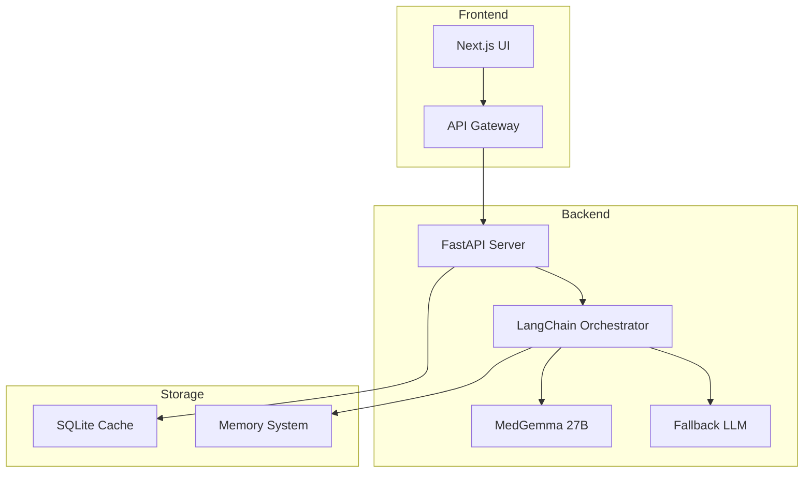

# 🤖 Chatbot Médico IMSS

## 📋 Descripción

Sistema de consulta médica inteligente que utiliza modelos de IA especializados para proporcionar respuestas médicas contextuales, análisis de imágenes médicas y consultas en lenguaje natural. El chatbot está diseñado para ser un asistente educativo y de apoyo para profesionales de la salud.

## 🏗️ Arquitectura



## 🚀 Características Principales

### **Consultas Médicas Inteligentes**
- Respuestas contextuales en lenguaje natural
- Análisis de síntomas y condiciones médicas
- Recomendaciones basadas en evidencia médica
- Streaming de respuestas en tiempo real

### **Análisis de Imágenes Médicas**
- Soporte para formatos JPG y PNG
- Análisis multimodal (imagen + texto)
- Descripción detallada de hallazgos
- Sugerencias de diagnóstico diferencial

### **Sistema de Memoria**
- Memoria de conversación contextual
- Persistencia de consultas anteriores
- Entidades médicas reconocidas
- Contexto de paciente mantenido

## 🛠️ Tecnologías Utilizadas

- **Backend**: FastAPI + Python 3.8+
- **IA**: Google MedGemma 27B + LangChain
- **Base de Datos**: SQLite (cache local)
- **API**: RESTful con streaming
- **Validación**: Pydantic models

## 📦 Instalación

### **Prerrequisitos:**
```bash
Python 3.8+
pip install -r requirements.txt
```

### **Instalación:**
```bash
cd chatbot
pip install -r requirements.txt
```

### **Configuración:**
```bash
# Variables de entorno (opcional)
export LM_STUDIO_URL=http://localhost:1234
export MEDGEMMA_ENDPOINT=your_endpoint_here
```

## 🚀 Ejecución

### **Desarrollo:**
```bash
python main.py
```

### **Producción:**
```bash
uvicorn main:app --host 0.0.0.0 --port 5001
```

### **Con Docker:**
```bash
docker build -t chatbot-imss .
docker run -p 5001:5001 chatbot-imss
```

## 📡 API Endpoints

### **POST /api/chat**
Iniciar conversación con el chatbot médico.

**Request:**
```json
{
  "message": "Tengo dolor en el pecho, ¿qué puede ser?",
  "conversation_id": "optional-uuid",
  "include_image": false
}
```

**Response:**
```json
{
  "response": "El dolor en el pecho puede tener múltiples causas...",
  "conversation_id": "uuid",
  "entities": ["dolor", "pecho"],
  "confidence": 0.85
}
```

### **POST /api/chat/stream**
Conversación con streaming en tiempo real.

**Request:**
```json
{
  "message": "Analiza esta radiografía",
  "image": "base64_encoded_image",
  "conversation_id": "uuid"
}
```

**Response:** Server-Sent Events (SSE)

### **GET /api/health**
Verificar estado del servicio.

**Response:**
```json
{
  "status": "healthy",
  "timestamp": "2024-01-01T00:00:00Z",
  "version": "1.0.0"
}
```

## 🔧 Configuración Avanzada

### **Modelos de IA:**
```python
# Configuración de MedGemma
MEDGEMMA_CONFIG = {
    "model_name": "medgemma-27b-it",
    "temperature": 0.7,
    "max_tokens": 2048,
    "top_p": 0.9
}

# Configuración de fallback
FALLBACK_CONFIG = {
    "model_name": "gpt-3.5-turbo",
    "temperature": 0.5,
    "max_tokens": 1024
}
```

### **Memoria y Cache:**
```python
# Configuración de memoria
MEMORY_CONFIG = {
    "max_conversations": 1000,
    "conversation_ttl": 3600,  # 1 hora
    "entity_extraction": True
}

# Configuración de cache
CACHE_CONFIG = {
    "cache_size": 1000,
    "ttl": 1800,  # 30 minutos
    "persistent": True
}
```

## 📊 Monitoreo

### **Logs:**
```bash
# Ver logs en tiempo real
tail -f logs/chatbot.log

# Logs con filtros
grep "ERROR" logs/chatbot.log
grep "WARNING" logs/chatbot.log
```

### **Métricas:**
- Número de consultas por minuto
- Tiempo de respuesta promedio
- Tasa de éxito de respuestas
- Uso de memoria y CPU

## 🧪 Testing

### **Tests Unitarios:**
```bash
pytest tests/unit/
```

### **Tests de Integración:**
```bash
pytest tests/integration/
```

### **Tests de API:**
```bash
pytest tests/api/
```

## 🔒 Seguridad

### **Validación de Entrada:**
- Sanitización de mensajes de usuario
- Validación de imágenes (formato y tamaño)
- Límites de rate limiting
- Filtrado de contenido sensible

### **Privacidad:**
- No almacenamiento de datos personales
- Anonimización de consultas
- Cumplimiento con LFPDPPP
- Logs sin información sensible

## 🚨 Limitaciones y Consideraciones

### **Limitaciones Técnicas:**
- Requiere conexión a internet para modelos externos
- Limitado a formatos JPG y PNG
- Tamaño máximo de imagen: 10MB
- Tiempo de respuesta: 2-30 segundos

### **Limitaciones Médicas:**
- **NO es un dispositivo médico**
- **NO reemplaza el juicio clínico**
- **NO debe usarse para diagnóstico clínico**
- Requiere supervisión médica profesional

## 📈 Roadmap

### **Versión 1.1:**
- [ ] Soporte para más formatos de imagen
- [ ] Integración con bases de datos médicas
- [ ] Análisis de sentimientos en consultas
- [ ] Exportación de conversaciones

### **Versión 1.2:**
- [ ] Soporte multiidioma
- [ ] Integración con sistemas hospitalarios
- [ ] Análisis de patrones de consultas
- [ ] Dashboard de administración

## 🤝 Contribuir

1. Fork del repositorio
2. Crear rama feature (`git checkout -b feature/nueva-funcionalidad`)
3. Commit cambios (`git commit -m 'Agregar nueva funcionalidad'`)
4. Push a la rama (`git push origin feature/nueva-funcionalidad`)
5. Crear Pull Request

## 📄 Licencia

Este proyecto está bajo la licencia MIT. Ver `LICENSE` para más detalles.

## 📞 Soporte

- **Issues**: Reportar problemas en el repositorio
- **Documentación**: Ver documentación completa en `/docs`
- **Email**: [soporte@imss.ai]

---

*Desarrollado para el IMSS con ❤️ y IA*
