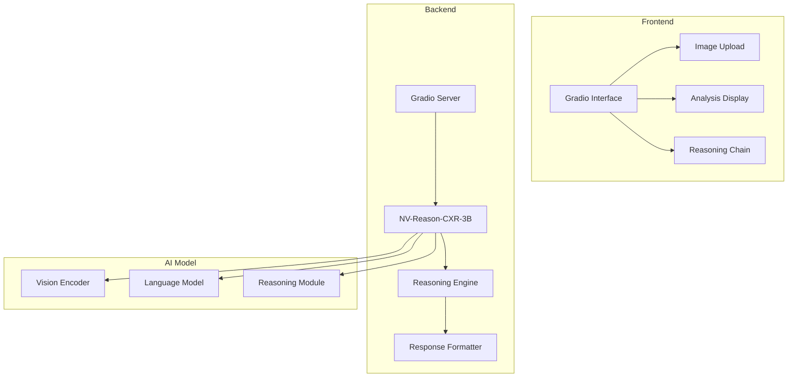

# 🔬 NV-Reason-CXR IMSS

## 📋 Descripción

Sistema especializado de análisis de radiografías de tórax que utiliza el modelo NVIDIA NV-Reason-CXR-3B para proporcionar análisis detallados con cadena de razonamiento paso a paso. Este servicio demuestra las capacidades avanzadas de los modelos de lenguaje visual (VLM) especializados en radiología torácica.

## 🏗️ Arquitectura



## 🚀 Características Principales

### **Análisis con Cadena de Razonamiento**
- Explicación paso a paso del análisis
- Justificación de cada hallazgo identificado
- Proceso de pensamiento transparente
- Confianza en cada diagnóstico

### **Modelo Especializado en Tórax**
- Entrenado específicamente en radiografías de tórax
- Reconocimiento de patrones patológicos complejos
- Diagnósticos diferenciales precisos
- Análisis de múltiples regiones anatómicas

### **Interfaz Intuitiva**
- Subida de imágenes drag-and-drop
- Visualización clara de resultados
- Interfaz web responsiva
- Integración con otros servicios

### **Análisis Multimodal**
- Procesamiento de imagen + texto
- Contexto clínico integrado
- Preguntas específicas del usuario
- Respuestas contextualizadas

## 🛠️ Tecnologías Utilizadas

- **Backend**: Gradio + Python 3.8+
- **IA**: NVIDIA NV-Reason-CXR-3B
- **Procesamiento**: Transformers + PyTorch
- **Interfaz**: Gradio Web UI
- **API**: RESTful endpoints

## 📦 Instalación

### **Prerrequisitos:**
```bash
Python 3.8+
CUDA 11.8+ (recomendado)
8GB+ RAM
```

### **Instalación:**
```bash
cd nv-reason-cxr
pip install -r requirements.txt
```

### **Configuración del Modelo:**
```bash
# Descargar modelo (automático en primera ejecución)
python -c "from transformers import AutoModel; AutoModel.from_pretrained('nvidia/NV-Reason-CXR-3B')"
```

## 🚀 Ejecución

### **Desarrollo:**
```bash
python app.py
```

### **Producción:**
```bash
# Con configuración específica
python app.py --host 0.0.0.0 --port 5005 --share
```

### **Con Docker:**
```bash
docker build -t nv-reason-cxr .
docker run -p 5005:5005 nv-reason-cxr
```

## 📡 API Endpoints

### **GET /**
Interfaz principal de Gradio.

**Descripción**: Interfaz web para subir imágenes y realizar análisis.

### **POST /api/predict**
Análisis de radiografía de tórax.

**Request:**
```json
{
  "image": "base64_encoded_image",
  "question": "¿Qué hallazgos patológicos observas?",
  "include_reasoning": true
}
```

**Response:**
```json
{
  "analysis": {
    "findings": [
      {
        "region": "lobe_inferior_derecho",
        "finding": "consolidation",
        "description": "Consolidación alveolar en el lóbulo inferior derecho",
        "confidence": 0.89,
        "reasoning": "Se observa opacidad homogénea que oblitera los márgenes del corazón y el diafragma..."
      }
    ],
    "differential_diagnosis": [
      {
        "diagnosis": "neumonía_community_acquired",
        "probability": 0.75,
        "reasoning": "La consolidación lobar es característica de neumonía bacteriana..."
      }
    ],
    "recommendations": [
      "Considerar tomografía computarizada para confirmación",
      "Cultivo de esputo para identificación del patógeno",
      "Hemograma completo y marcadores inflamatorios"
    ]
  },
  "reasoning_chain": [
    "1. Análisis inicial de la imagen: Se observa una radiografía de tórax PA...",
    "2. Identificación de regiones: El lóbulo inferior derecho muestra...",
    "3. Evaluación de hallazgos: La consolidación presenta características...",
    "4. Diagnóstico diferencial: Considerando la distribución y características..."
  ],
  "confidence_scores": {
    "overall": 0.87,
    "findings": 0.89,
    "diagnosis": 0.75,
    "reasoning": 0.92
  }
}
```

## 🔬 Capacidades del Modelo

### **Análisis Anatómico:**
- Identificación de estructuras torácicas
- Evaluación de posición y técnica
- Reconocimiento de variantes normales
- Detección de artefactos técnicos

### **Detección de Patologías:**
- **Consolidación**: Neumonía, atelectasia
- **Derrame pleural**: Líquido en cavidad pleural
- **Neumotórax**: Aire en cavidad pleural
- **Edema pulmonar**: Insuficiencia cardíaca
- **Nódulos pulmonares**: Lesiones focales

### **Diagnósticos Diferenciales:**
- Análisis comparativo de patologías
- Probabilidades de diagnóstico
- Justificación de exclusiones
- Recomendaciones de seguimiento

## 🔧 Configuración Avanzada

### **Configuración del Modelo:**
```python
MODEL_CONFIG = {
    "model_name": "nvidia/NV-Reason-CXR-3B",
    "device": "cuda",  # o "cpu"
    "precision": "float16",
    "max_length": 2048,
    "temperature": 0.7
}
```

### **Configuración de Análisis:**
```python
ANALYSIS_CONFIG = {
    "confidence_threshold": 0.7,
    "max_findings": 10,
    "include_reasoning": True,
    "detailed_explanations": True
}
```

### **Configuración de Gradio:**
```python
GRADIO_CONFIG = {
    "theme": "default",
    "height": 600,
    "width": 800,
    "allow_flagging": "never",
    "show_error": True
}
```

## 📊 Monitoreo y Performance

### **Métricas del Modelo:**
- Tiempo de inferencia por imagen
- Uso de memoria GPU/CPU
- Precisión de diagnósticos
- Confianza promedio

### **Logs del Sistema:**
```bash
# Ver logs en tiempo real
tail -f logs/nv-reason-cxr.log

# Logs de análisis
grep "analysis" logs/nv-reason-cxr.log

# Logs de errores
grep "ERROR" logs/nv-reason-cxr.log
```

### **Optimización de Performance:**
```python
# Configuración para mejor performance
PERFORMANCE_CONFIG = {
    "batch_size": 1,
    "use_cache": True,
    "gradient_checkpointing": True,
    "mixed_precision": True
}
```

## 🧪 Testing

### **Tests Unitarios:**
```bash
pytest tests/unit/
```

### **Tests de Modelo:**
```bash
pytest tests/model/
```

### **Tests de Performance:**
```bash
pytest tests/performance/
```

### **Tests de Integración:**
```bash
pytest tests/integration/
```

## 🔒 Seguridad y Privacidad

### **Protección de Datos:**
- No almacenamiento de imágenes
- Procesamiento en memoria únicamente
- Cumplimiento con LFPDPPP
- Encriptación de comunicaciones

### **Validación de Entrada:**
- Verificación de formato de imagen
- Límites de tamaño de archivo
- Sanitización de preguntas
- Filtrado de contenido sensible

## ⚠️ Limitaciones y Consideraciones

### **Limitaciones Técnicas:**
- Requiere GPU para mejor performance
- Limitado a radiografías de tórax
- Tamaño máximo de imagen: 10MB
- Tiempo de procesamiento: 5-30 segundos

### **Limitaciones Médicas:**
- **NO es un dispositivo médico**
- **NO reemplaza el juicio clínico**
- **NO debe usarse para diagnóstico clínico**
- Requiere supervisión médica profesional

## 📈 Roadmap

### **Versión 1.1:**
- [ ] Soporte para más modalidades de imagen
- [ ] Análisis comparativo temporal
- [ ] Integración con PACS
- [ ] API RESTful completa

### **Versión 1.2:**
- [ ] Modelo fine-tuned para casos específicos
- [ ] Análisis de múltiples imágenes
- [ ] Integración con sistemas hospitalarios
- [ ] Dashboard de administración

## 🎯 Casos de Uso

### **Para Radiólogos:**
- Herramienta de apoyo diagnóstico
- Segunda opinión automatizada
- Análisis de casos complejos
- Educación continua

### **Para Estudiantes:**
- Aprendizaje de patrones radiológicos
- Desarrollo de habilidades diagnósticas
- Preparación para exámenes
- Casos de estudio interactivos

### **Para Investigación:**
- Análisis de grandes volúmenes de datos
- Validación de algoritmos
- Estudios de precisión diagnóstica
- Desarrollo de nuevos modelos

## 🤝 Contribuir

1. Fork del repositorio
2. Crear rama feature (`git checkout -b feature/nueva-funcionalidad`)
3. Commit cambios (`git commit -m 'Agregar nueva funcionalidad'`)
4. Push a la rama (`git push origin feature/nueva-funcionalidad`)
5. Crear Pull Request

## 📄 Licencia

Este proyecto está bajo la licencia NVIDIA OneWay Non-Commercial License. Ver `LICENSE` para más detalles.

## 📞 Soporte

- **Issues**: Reportar problemas en el repositorio
- **Documentación**: Ver documentación completa en `/docs`
- **Email**: [nv-reason-cxr@imss.ai]

---

*Razonando el futuro de la radiología con IA especializada*