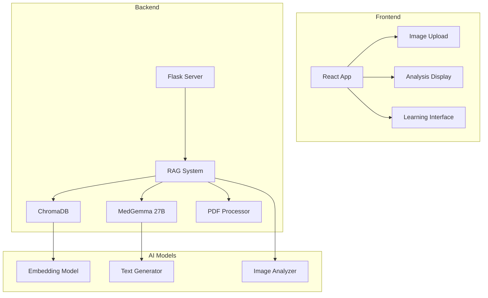

# 🫁 Radiografías de Tórax IMSS

## 📋 Descripción

Sistema especializado de análisis de radiografías de tórax que utiliza técnicas de RAG (Retrieval-Augmented Generation) y modelos de IA especializados para proporcionar análisis detallados, diagnósticos diferenciales y educación radiológica interactiva. Diseñado específicamente para el aprendizaje y práctica de radiología torácica.

## 🏗️ Arquitectura



## 🚀 Características Principales

### **Análisis Especializado de Radiografías**
- Análisis automático de radiografías de tórax
- Identificación de hallazgos patológicos
- Diagnósticos diferenciales automáticos
- Explicaciones detalladas de cada hallazgo

### **Sistema RAG Avanzado**
- Base de conocimiento de guías médicas
- Búsqueda semántica en documentos
- Referencias bibliográficas actualizadas
- Contexto clínico relevante

### **Interfaz de Aprendizaje Interactiva**
- Casos de estudio progresivos
- Comparación lado a lado
- Anotaciones interactivas
- Sistema de progreso personalizado

### **Múltiples Formatos de Imagen**
- Soporte para JPG y PNG
- Validación automática de calidad
- Preprocesamiento inteligente
- Optimización de imágenes

## 🛠️ Tecnologías Utilizadas

- **Frontend**: React + Vite + CSS Modules
- **Backend**: Flask + Python 3.8+
- **IA**: MedGemma 27B + LangChain
- **Base de Datos**: ChromaDB (vector store)
- **Procesamiento**: PyPDF2 + Pillow
- **API**: RESTful endpoints

## 📦 Instalación

### **Prerrequisitos:**
```bash
Python 3.8+
Node.js 18+
ChromaDB
```

### **Instalación Backend:**
```bash
cd radiografias_torax/backend
pip install -r requirements.txt
```

### **Instalación Frontend:**
```bash
cd radiografias_torax/frontend
npm install
```

### **Configuración de Base de Datos:**
```bash
# Inicializar ChromaDB
python init_database.py

# Cargar guías médicas
python load_guidelines.py
```

## 🚀 Ejecución

### **Desarrollo (Backend):**
```bash
cd backend
python app.py
```

### **Desarrollo (Frontend):**
```bash
cd frontend
npm run dev
```

### **Producción:**
```bash
# Compilar frontend
cd frontend
npm run build

# Ejecutar backend
cd backend
python app.py
```

### **Con Docker:**
```bash
docker-compose up -d
```

## 📡 API Endpoints

### **GET /api/health**
Verificar estado del servicio.

**Response:**
```json
{
  "status": "healthy",
  "timestamp": "2024-01-01T00:00:00Z",
  "database": "connected",
  "models": "loaded"
}
```

### **POST /api/analyze_chest_xray**
Analizar radiografía de tórax.

**Request:**
```json
{
  "image": "base64_encoded_image",
  "clinical_context": "Paciente de 45 años con tos persistente",
  "analysis_type": "comprehensive"
}
```

**Response:**
```json
{
  "analysis": {
    "findings": [
      {
        "region": "lobe_inferior_derecho",
        "finding": "consolidation",
        "description": "Consolidación alveolar en el lóbulo inferior derecho",
        "confidence": 0.89
      }
    ],
    "differential_diagnosis": [
      {
        "diagnosis": "neumonía_community_acquired",
        "probability": 0.75,
        "reasoning": "Consolidación focal con distribución lobar..."
      }
    ],
    "recommendations": [
      "Considerar tomografía computarizada",
      "Cultivo de esputo",
      "Hemograma completo"
    ]
  },
  "educational_content": {
    "anatomy_notes": "El lóbulo inferior derecho...",
    "pathophysiology": "La consolidación alveolar ocurre cuando...",
    "references": ["guideline_1", "case_study_2"]
  }
}
```

### **GET /api/cases**
Obtener casos de estudio disponibles.

**Response:**
```json
{
  "cases": [
    {
      "id": "case_001",
      "title": "Neumonía Comunitaria",
      "difficulty": "intermediate",
      "description": "Caso de neumonía en paciente adulto...",
      "image_count": 3,
      "learning_objectives": [
        "Identificar consolidación alveolar",
        "Diferenciar de atelectasia",
        "Reconocer patrones de neumonía"
      ]
    }
  ]
}
```

### **POST /api/search_guidelines**
Buscar en guías médicas.

**Request:**
```json
{
  "query": "neumonía adquirida en la comunidad",
  "max_results": 5
}
```

**Response:**
```json
{
  "results": [
    {
      "title": "Guía de Neumonía Comunitaria",
      "excerpt": "La neumonía adquirida en la comunidad...",
      "page": 15,
      "relevance_score": 0.92,
      "source": "WHO Guidelines"
    }
  ]
}
```

## 🎓 Funcionalidades Educativas

### **Casos de Estudio Progresivos**
- **Nivel Básico**: Anatomía normal, variantes normales
- **Nivel Intermedio**: Patologías comunes, diagnósticos diferenciales
- **Nivel Avanzado**: Casos complejos, patologías raras

### **Sistema de Aprendizaje Adaptativo**
- Dificultad ajustada según el progreso
- Refuerzo de conceptos débiles
- Evaluación continua de competencias
- Certificación de habilidades

### **Recursos de Aprendizaje**
- Atlas de anatomía torácica
- Guías clínicas actualizadas
- Casos de estudio interactivos
- Glosario de términos radiológicos

## 🔧 Configuración Avanzada

### **Configuración de RAG:**
```python
RAG_CONFIG = {
    "chunk_size": 1000,
    "chunk_overlap": 200,
    "embedding_model": "sentence-transformers/all-MiniLM-L6-v2",
    "retrieval_k": 5,
    "similarity_threshold": 0.7
}
```

### **Configuración de Análisis:**
```python
ANALYSIS_CONFIG = {
    "confidence_threshold": 0.7,
    "max_findings": 10,
    "include_differential": True,
    "educational_mode": True
}
```

### **Configuración de Imágenes:**
```python
IMAGE_CONFIG = {
    "max_size": 10 * 1024 * 1024,  # 10MB
    "allowed_formats": ["jpg", "jpeg", "png"],
    "preprocessing": True,
    "quality_check": True
}
```

## 📊 Monitoreo y Analytics

### **Métricas de Análisis:**
- Número de radiografías analizadas
- Precisión de diagnósticos
- Tiempo promedio de análisis
- Patrones de error comunes

### **Métricas de Aprendizaje:**
- Progreso por usuario
- Casos completados
- Puntuaciones por dificultad
- Tiempo de aprendizaje

### **Logs del Sistema:**
```bash
# Ver logs en tiempo real
tail -f logs/radiografias.log

# Logs de análisis
grep "analysis" logs/radiografias.log

# Logs de búsquedas
grep "search" logs/radiografias.log
```

## 🧪 Testing

### **Tests Unitarios:**
```bash
pytest tests/unit/
```

### **Tests de Análisis:**
```bash
pytest tests/analysis/
```

### **Tests de RAG:**
```bash
pytest tests/rag/
```

### **Tests de Rendimiento:**
```bash
pytest tests/performance/
```

## 🔒 Seguridad y Privacidad

### **Protección de Datos:**
- No almacenamiento de imágenes de pacientes reales
- Anonimización de datos de usuario
- Cumplimiento con LFPDPPP
- Encriptación de datos sensibles

### **Validación de Contenido:**
- Verificación de fuentes médicas
- Validación por expertos radiólogos
- Actualización regular de contenido
- Filtrado de información sensible

## 📈 Roadmap

### **Versión 1.1:**
- [ ] Soporte para más modalidades de imagen
- [ ] Integración con PACS
- [ ] Análisis comparativo temporal
- [ ] Sistema de competencias

### **Versión 1.2:**
- [ ] Realidad aumentada
- [ ] Análisis 3D
- [ ] Integración con LMS
- [ ] Certificación profesional

## 🎯 Casos de Uso

### **Para Estudiantes de Medicina:**
- Aprendizaje de anatomía torácica
- Reconocimiento de patrones patológicos
- Desarrollo de habilidades diagnósticas
- Preparación para exámenes

### **Para Residentes de Radiología:**
- Casos clínicos complejos
- Actualización de conocimientos
- Preparación para especialización
- Evaluación de competencias

### **Para Profesores:**
- Herramienta de enseñanza
- Generación de casos personalizados
- Seguimiento del progreso estudiantil
- Recursos educativos actualizados

## 🤝 Contribuir

1. Fork del repositorio
2. Crear rama feature (`git checkout -b feature/nueva-funcionalidad`)
3. Commit cambios (`git commit -m 'Agregar nueva funcionalidad'`)
4. Push a la rama (`git push origin feature/nueva-funcionalidad`)
5. Crear Pull Request

## 📄 Licencia

Este proyecto está bajo la licencia MIT. Ver `LICENSE` para más detalles.

## 📞 Soporte

- **Issues**: Reportar problemas en el repositorio
- **Documentación**: Ver documentación completa en `/docs`
- **Email**: [radiografias@imss.ai]

---

*Analizando el futuro de la radiología con IA*